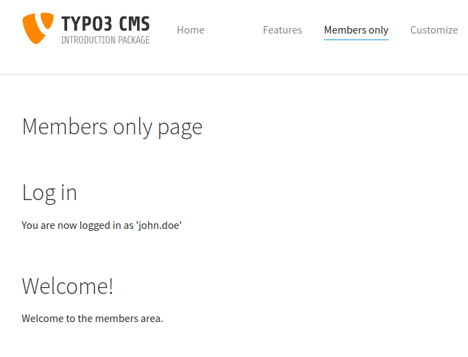

.. include:: ../../Includes.txt

.. _frontend-login:

Frontend login
^^^^^^^^^^^^^^

Going further it is actually possible to require proper
authentication to access parts of the information contained
in your web site.

.. _frontend-login-users:

Frontend users
""""""""""""""

As with the rest of TYPO3 CMS, users are also separated
into frontend and backend users. Backend users are used to
authenticate into the backend and are used to manage your
TYPO3 CMS installation, create pages, input content, etc.

Frontend users live strictly in the frontend and are
used to restrict access to pages, content elements and any
other type of information which relies on the same
mechanism.

Frontend users are always part of frontend groups. Access is
granted to groups, never directly to users. Users and groups
are defined as any other record and stored in any suitable
page in the backend.

Use your new skills to create a new page of type "Folder"
and name it "Web site users".

.. figure:: ../../Images/AccessUserFolder.png
   :alt: Creating a folder for storing the users and groups

Switch to **WEB > List** view and select your new folder.
Click on the "Create new record" icon at the left of the
docheader. The new record wizard appears.

.. figure:: ../../Images/AccessNewRecordWizard.png
   :alt: Selecting what type of record to create with the new record wizard

Click on "Website Usergroup" to create a new frontend group.

Just give it a name, that's enough to get started. Save the record
and close it. Now use the new record wizard again, but click on
"Website User".

The minimum input required here is a user name, a password and
a selection of at least one group. You can see how our newly
created "Private area" group is available for selection.

You can add personal data to your user if you wish, but it is not
needed. You can save the record and close it.

.. _frontend-login-rights:

Access rights
"""""""""""""

Now that we have at least one group, we can start assigning
access restrictions. Let's create a new page called "Members only"
and restrict it to the "Private area" group.

.. note::

   Two default groups appear in the list of groups. They are not
   strictly groups, in the sense that they are always available
   and cannot be edited nor removed.

   The "Hide at login" group means that the element is only visible
   when the user is not authenticated. The "Show at any login" group
   is used for elements which require authentication to access, but
   are okay for all groups to see.

Notice how the page icon changes as soon as you save the new
user rights. It it a visual reminder that this page is not
public.

Try accessing that new page. You will notice that you are
redirected to the home page. Access restriction is in place.

.. _frontend-login-form:

Login box
"""""""""

The next step is to place a login box somewhere so that
visitors can authenticate and view the restricted information.

Let's change our setup with the following step:

#. Remove the access restriction you just placed on the
   "Members only" page.

#. Create a "Text" content element, which says something like
   "You need to authenticate to access the members area" and choose
   the "Hide at login" group for it.

#. Create another "Text" content element with a text saying
   "Welcome to the members area" and choose the "Private area"
   group as access right.

You should have something like this:

Now let's add a login box to the party. Click on the "Create new content element"
button located between the two existing content elements. In the
new content element wizard, move to the "Form elements" tab
and click on "Login Form".

Give it a header and move to the "Plugin" tab.

The Login Form has many options, but the only one which is absolutely
necessary is the "User Storage Page". Use the record browser icon to
call up the page tree and choose the "Web site users" folder.

Save and view the page. You should have something like this:

Enter the user name and the password you defined earlier for the
new frontend user and you should see the following:

Note how the content element requesting authentication has disappeared,
replaced by the one welcoming the user.

