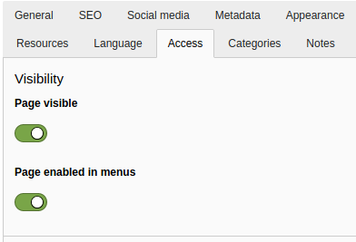
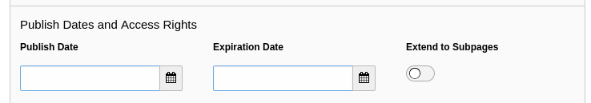

.. include:: /Includes.rst.txt

.. _visibility:

===================
Elements visibility
===================

When an element is hidden, be it a page, a content element or a news item, it
will not display in the frontend. You can, however, preview it in the backend.

In the Core, and in extensions that follow best practice, all options related
to visibility are controlled in the **Access** tab of the :ref:`page
properties <pages-properties>`.

.. _visibility-dates:

Publication dates
=================

You can specify a period of time for content to be visible. This might be
useful for seasonal announcements or festive periods.
Any page or content element with a defined :guilabel:`Publish Date`
will not be visible before that date. If it has an :guilabel:`Expiration
Date`, it will be hidden from that point onward.

When you set a publication date in the future then try to navigate to that
page, you are redirected to the home page.

When you enable the :guilabel:`Extend to Subpages` setting, the
publication date (and other access restrictions) also apply
to all child pages of the current page. This makes it possible
to apply restrictions to a whole branch of the page tree.
