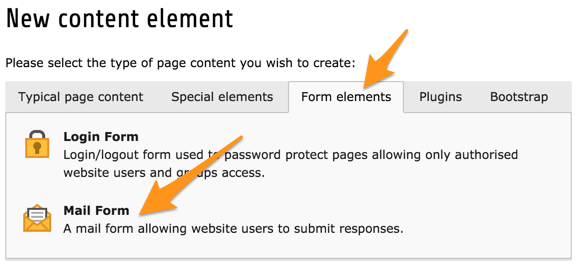
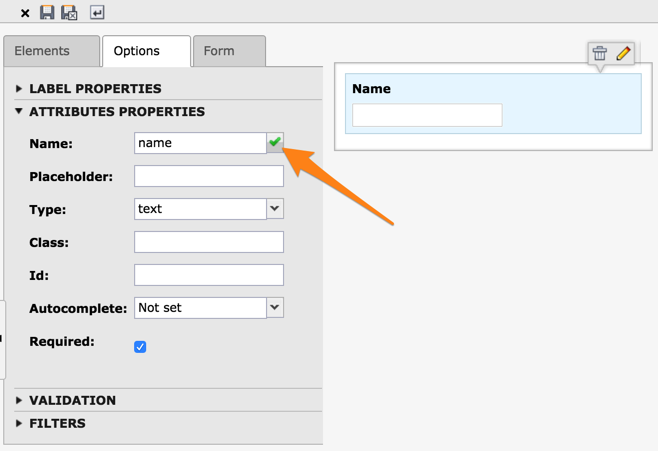

.. include:: ../../Includes.txt

.. _mail-form:

Creating a contact form
^^^^^^^^^^^^^^^^^^^^^^^

Setting up a contact form is slightly more complicated than other types
of content elements and requires additional information.

Create a new content element on any page and choose "Mail Form"
from the "Form elements" tab of the new content element wizard.

Give it a header and save it. Then move to the "Form" tab.

.. figure:: ../../Images/EditContentNewForm.png
   :alt: Choosing the mail form content element type

The text field contains the form configuration. This is written
in TypoScript and is fully documented in the
:ref:`"form" system extension manual <form:start>`.
This will seem daunting at first, but a wizard is provided for
WYSIWYG creation of the form. Click on the icon at the top right
of the configuration field.

.. figure:: ../../Images/EditContentFormWizard.png
   :alt: The form creation wizard

Simply start dragging and droppping form elements from the
left panel to the right panel.

In the left panel, you can set a number of properties for
each form field. To reflect your changed in the right panel,
click on the little check icon that appears when you change
some property.

Try adding some more fields, until you are happy. For a standard
contact form, you may want to add an input field for the topic,
another field for entering an email (try setting a validation
rule for that field) and a text area for the message.
Don't forget to add a submit button!

When you're done, click on the "Save and close form" button
in the docheader.

.. figure:: ../../Images/EditContentSaveForm.png
   :alt: Saving the form configuration

You will get back to the "Form" tab and you should see a lot
of TypoScript in the configuration field.

.. figure:: ../../Images/EditContentCompletedForm.png
   :alt: The wizard has generated the TypoScript configuration

Now choose the "Save and view page" option and you should
see a form like this one in your frontend:

.. figure:: ../../Images/EditContentFormOutput.png
   :alt: The contact form in the frontend

In order for your form to send a mail, there are a few settings
to adjust. Even though you may not yet be familiar with TypoScript,
modify the configuration field of your form like:

.. figure:: ../../Images/EditContentFormConfiguration.png
   :alt: Modifying the configuration of the form

The values given to the "senderEmailField", "senderEmailName" and
"subjectField" properties should correspond to the names you
gave to the fields in your form.

There are many more properties which can be defined. They are
described in the :ref:`"form" system extension manual <form:start>`.
