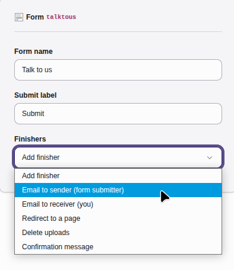

.. include:: /Includes.rst.txt

.. _mail-form:
.. _template-form:

=======================
Creating a contact form
=======================

..  image:: /Images/ManualScreenshots/ContentElements/ContactForm.png
    :alt: Content element Contact Form in the TYPO3 backend
    :class: img-thumbnail float-end ms-1 ms-1
    :width: 250
    :zoom: gallery

You can create a form from the :guilabel:`Web > Forms` module. This is a
system extension which needs to be activated by your administrator. It is
written in TypoScript and is fully documented in the :doc:`Form Framework <ext_form:Index>` system extension manual.

This module provides a guided interface for editors to create any kind of form
such as a contact form, newsletter subscription or even a survey. TYPO3 comes
with one pre-defined form already built, which you can use to get started.

#. In the :guilabel:`Web > Forms` module, click the :guilabel:`+ Create new
   form` button. The :guilabel:`Create new form` wizard displays.

   .. include:: /Images/AutomaticScreenshots/Forms/FormCreateNew.rst.txt

#. Choose whether you want to create a blank form or use a predefined form.
   In this case, choose :guilabel:`Predefined Form`.

   .. include:: /Images/AutomaticScreenshots/Forms/FormsSettingsStep1.rst.txt

#. Choose the predefined :guilabel:`Simple contact form` and enter a name.

   .. include:: /Images/AutomaticScreenshots/Forms/FormsSettingsStep2.rst.txt

#. Check the settings and click :guilabel:`Next` once more.

   .. include:: /Images/AutomaticScreenshots/Forms/FormsSettingsStep3.rst.txt

#. In the :guilabel:`Start template` list, select 'Simple contact form', and
   then type a name for the form.
#. Click :guilabel:`Next` and then click :guilabel:`Finish`. Your new form displays.

   .. include:: /Images/AutomaticScreenshots/Forms/FormsNewForm.rst.txt

   The predefined 'Simple contact form' comes with some settings already
   configured, but you can edit these settings and add more fields. For
   example, you might want to delete the Summary page, and change
   the labels on the buttons.

#. Add your form to a page the same way you would add any
   :ref:`content element<content-form>`. On the  :guilabel:`Form elements` tab, choose 'Form'.
#. In the form content element, go to the :guilabel:`Plugin` tab and in the
   :guilabel:`Form definition` list, choose your form.

   .. include:: /Images/AutomaticScreenshots/Forms/FormsFormDefinition.rst.txt

#. On the :guilabel:`General` tab, type a header for your form, then save and close
   the record.

   Preview the page and it should look something like this:

   .. include:: /Images/AutomaticScreenshots/Forms/FormOutput.rst.txt

.. _Create-form-scratch:

Create a form from scratch
==========================

#. In the :guilabel:`Web > Forms` module, click the :guilabel:`+ Create new
   form` button.
#. In the :guilabel:`Create new form` wizard, choose to create a blank form.
#. Give your form a name, then click :guilabel:`Next` and :guilabel:`Finish`.

   A blank form displays.

   .. include:: /Images/AutomaticScreenshots/FormsBlank/FormsBlankForm.rst.txt

#. Click the :guilabel:`Create new element` button. The :guilabel:`New element`
   window displays.

   .. include:: /Images/AutomaticScreenshots/FormsBlank/FormsNewElement.rst.txt

   TYPO3 comes with over twenty form fields by default, including:

   *  **Basic elements** like text or password fields
   *  **Special elements** requiring specific format validation, like phone
      numbers or dates
   *  **Select elements** like checkboxes or multiple choice
   *  **Advanced elements** that have special rules, like user uploads or
      calendar date pickers
   *  **Container elements** to visually organize surveys

   Once you’ve selected a form element, you can customize the settings for how the field is displayed.

#. Choose the :guilabel:`Text` element and the field is added to your form. You can
   configure settings for the field (such as placeholder text and field
   validation) on the right-hand side of the screen .

   .. include:: /Images/AutomaticScreenshots/FormsBlank/FormsFieldSettings.rst.txt

#. Click the :guilabel:`Preview mode` icon to see an indication of how your
   form will display on the frontend. Use the :guilabel:`Edit mode` icon to
   return to editing your form.

   .. include:: /Images/AutomaticScreenshots/FormsBlank/FormsPreview.rst.txt

.. _Working-with-Forms:

Working with forms
==================

When you have added multiple fields to your form, you can drag and drop them
to rearrange their order.

Click the :guilabel:`Settings` button at the top of the form to add
:guilabel:`Finishers` like a confirmation message or redirection to another page.

You can integrate extensions with existing forms. For example, if you're
running a sales operation, you can integrate with Mautic and any changes to a
TYPO3 form will update Mautic to give you seamless lead tracking.

.. tip::

   There are many more properties that can be defined. They are
   described in the :doc:`"Form Framework" <ext_form:Index>` system extension
   manual.
