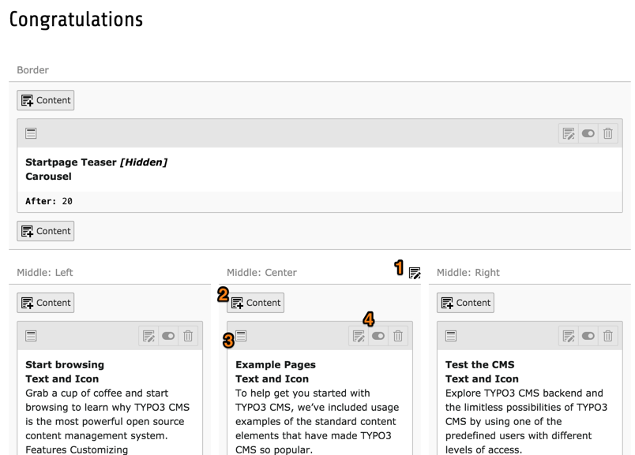

.. include:: ../../Includes.txt

.. _content-working:

Working with content
^^^^^^^^^^^^^^^^^^^^

Working with content happens essentially in the **WEB > Page** module.
We will start by taking a tour of the module, which is quite rich.

The *Page* module has two different modes or functions: "Columns"
and "Languages". The "Languages" mode will be discussed later when talking
about translations.

For now we want to be in "Columns" mode. If that is not the case when
you move to the *Page* module, please use the menu in the doc header to
switch mode.

.. figure:: ../../Images/PageModuleFunctions.png
   :alt: Changing mode in the Page module

The screenshot below shows how the home page of the Introduction
Package looks like in the TYPO3 CMS backend. Content is distributed
among various content areas ("Border", "Middle: Left", "Middle: Center", etc.)
which are called **columns**.

Many icons are greyed out to make the interface look less cluttered.
Some icons don't appear at all until your hover over specific areas.

What can be seen in this view?

#. This icon only appears when you hover over the column title.
   It is used to edit all content elements of that column.

#. Adds a new content element to this column at precisely that position.

#. This icon represents the type of the content element. In that case
   it is a custom content element which relies on the default icon,
   but it may vary and provides a visual clue to the type.

#. These icons light up when hovering over the whole element.
   They are used to edit this content element, enable/disable it
   or delete it respectively.

You can click anywhere on the highlighted area of a content element to edit it.

.. _content-working-moving:

Moving content elements
^^^^^^^^^^^^^^^^^^^^^^^

Content elements can be moved around simply using drap and drop.

.. figure:: ../../Images/PageModuleMoveElements.png
   :alt: Moving content elements around using drap and drop

Click in the grey bar at the top of a content element to start
dragging it. The *Page* module will then show you where you can
drop it.

Moving a content element from one page to another is more
convoluted, as you have to use the *List* module to perform
a cut and paste operation. Please refer to the
:ref:`Getting Started Tutorial <t3start:clipboard>` for
usage of the *List* module.
