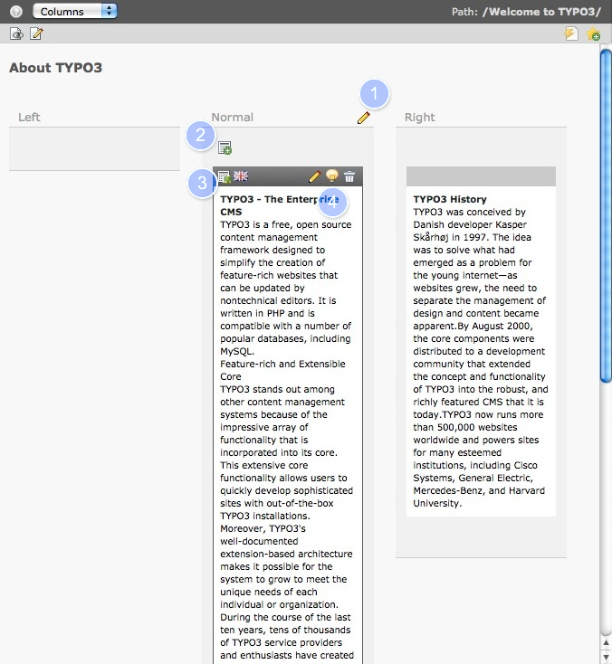

.. ==================================================
.. FOR YOUR INFORMATION
.. --------------------------------------------------
.. -*- coding: utf-8 -*- with BOM.

.. include:: ../../Includes.txt

.. _content-working:

Working with Content
^^^^^^^^^^^^^^^^^^^^

We will now discuss the work area of the page module, where most of
the work is usually done. Don't be scared by the many icons and
buttons, as they are somewhat redundant. Use the mouse to point and
hover (do not click) over any icon to see the help text appear.
At first we will discuss working with content, later we will talk
about how to work with pages.

The screenshot shows the work area of the page module after clicking on the
name of a page in the page tree. You can see two **content elements** one in
the column called  *Normal* and one in the column *Right*, the column *Left*
is empty.

The content elements on this page are type **text** and **text with image**,
and we'll learn more about different content types later on. Moving over
a column or an content element will highlight it, so that you will see
the icons.

#. Edit all content elements of one column.

#. Add a new content element to this column.

#. Icon of the content element *Text with image*

#. Edit this content element, enable/disable or delete it.

You can click anywhere on the highlighted area of the content element to edit it.
