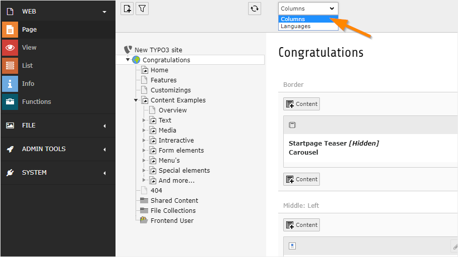
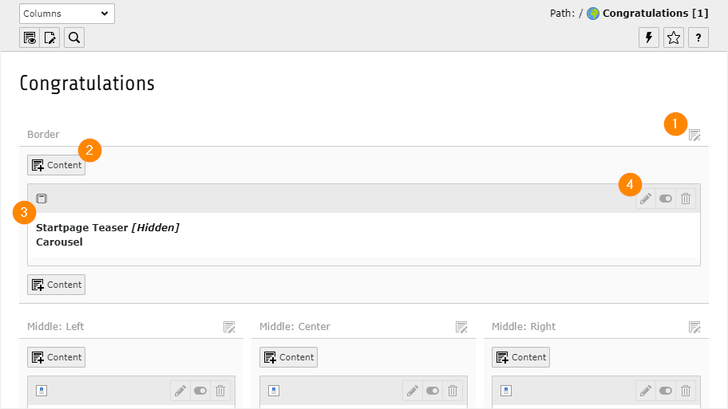
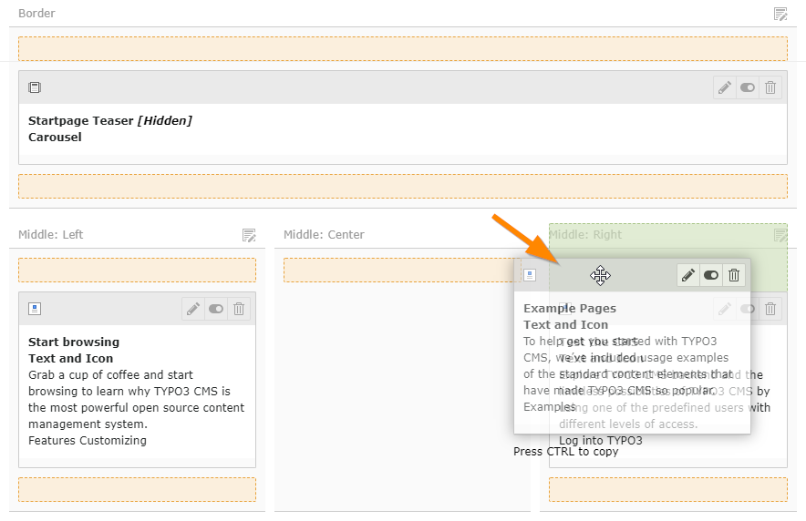

.. include:: /Includes.rst.txt

.. _content-working:

====================
Working with content
====================

In TYPO3, working with content happens mostly in the :guilabel:`Web > Page`
module.

This module has two different modes: "Columns" and "Languages". See
:ref:`Working with languages <languages>` for more information about the
"Languages" mode.

For now we want to be in "Columns" mode. Use the menu in the docheader to
switch modes.

The screenshot below shows how the home page of the Introduction
Package looks in the TYPO3 backend. Content is distributed
across various content areas on the page - these are called  **columns**. For
example, "Border", "Middle: Left", "Middle: Center", etc.

Many icons are greyed out to make the interface look less cluttered.
Some icons don't display at all until your hover over specific areas.

Common page icons explained:

#. Use this icon to edit all the content elements of a column.

#. Add a new content element to the column at this specific position.

#. Content element icon. This can provide a visual clue to the type of content
   element. Click to access the context menu for the element (to perform
   actions like *copy*).

#. This group of icons is enabled when hovering over the whole element.

   *  Use the pencil icon to edit the element.
   *  Enable/disable the element to show or hide it in the frontend
   *  Delete the element.

.. _content-working-moving:

Moving content elements
=======================

You can move content elements using drag and drop.

Click in the grey bar at the top of a content element to start dragging it.
Highlighted areas will then show you where you can drop it.

You can move a content element from one page to another in the :guilabel:`Web
> List` module using cut and paste. Refer to the :ref:`Getting Started
Tutorial <t3start:clipboard>` for information about using the clipboard in the
the **List** module.
