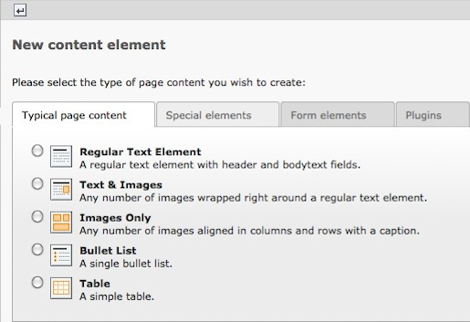
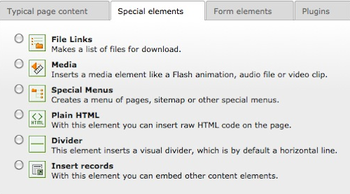
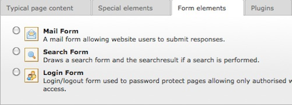
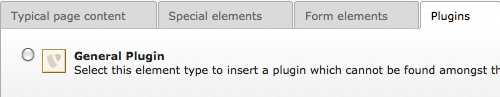

.. ==================================================
.. FOR YOUR INFORMATION
.. --------------------------------------------------
.. -*- coding: utf-8 -*- with BOM.

.. include:: ../../Includes.txt

.. _content-creating:

Creating Content
^^^^^^^^^^^^^^^^

Once you have clicked to create a new content element, you will see a
page with various content types available for selection.
Note that the content type selections available to you are dependent
on the features you have installed in your TYPO3 system.

In the first step you can then select which type of content you want
to have, use the other tabs to choose different types of content elements.

In the following step you will be able to edit the new content.

.. _content-typical:

Typical Page Content
""""""""""""""""""""

.. _content-special:

Special Elements
""""""""""""""""

.. _content-form:

Form Elements
"""""""""""""

.. _content-plugin:

Plugins
"""""""

In the next step you will already insert your first content
