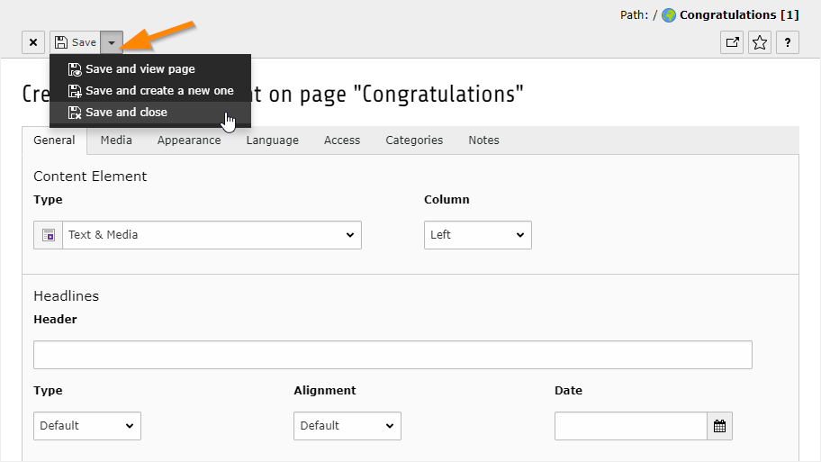

.. include:: ../../Includes.txt

.. _content-creating:

Création de contenu
^^^^^^^^^^^^^^^^^^^

Cliquez sur l'une des icônes "Ajouter du contenu".
Se présente à vous un assistant vous permettant de choisir
le type d'élément de contenu que vous souhaitez ajouter à votre page.
Cette liste peut varier en fonction de votre configuration
et des extensions installées.

Nous allons saisir cette occasion pour passer brièvement
en revue les différents types d'éléments de contenu.
L'assistant fournit déjà lui-même des descriptions le plus souvent explicites.

.. tip::

   **Sujet avancé :** l'ensemble de cet assistant est configurable
   en utilisant ce qu'on appelle le :ref:`Page TSConfig <t3tsconfig:pagenewcontentelementwizard>`.

.. _content-types:

Les types d'éléments de contenu
"""""""""""""""""""""""""""""""

.. _content-typical:

Elément de contenu classique
~~~~~~~~~~~~~~~~~~~~~~~~~~~~

.. figure:: ../../Images/NewContentWizardTabTypical.png
   :alt: L'onglet "Élément de contenu classique" de l'assistant de nouvel élément de contenu

.. _content-special:

Eléments spéciaux
~~~~~~~~~~~~~~~~

.. figure:: ../../Images/NewContentWizardTabSpecial.png
   :alt: L'onglet "Eléments spéciaux" de l'assistant de nouvel élément de contenu

L'élément "enregistre Insérer" est utilisé pour faire référence
à d'autres éléments de contenu. De cette façon, vous pouvez
réutiliser le contenu d'une autre page sans le dupliquer.

.. _content-form:

Formulaires
~~~~~~~~~~~

.. figure:: ../../Images/NewContentWizardTabForm.png
   :alt: L'onglet "Formulaires" de l'assistant de nouvel élément de contenu

.. _content-plugin:

Modules (plugins)
~~~~~~~~~~~~~~~~~

.. figure:: ../../Images/NewContentWizardTabPlugins.png
   :alt: L'onglet "Modules" de l'assistant de nouvel élément de contenu

Les modules sont fournis par des extensions.
Tous les plugins n'apparaissent pas dans cet onglet.
Cela dépend de leur architecture ou de la configuration du backend.

.. _content-bootstrap:

Bootstrap
~~~~~~~~~

.. figure:: ../../Images/NewContentWizardTabBootstrap.png
   :alt: L'onglet "Bootstrap" de l'assistant de nouvel élément de contenu

L'onglet Bootstrap provient du paquet d'introduction.
Il affiche la liste de tous les éléments de contenu personnalisés
fournis par l'extension "bootstrap_package" sur la quelle repose
le paquet d'introduction.

.. _content-new-element:

Création d'un nouvel élément de contenu
"""""""""""""""""""""""""""""""""""""""

Retournez sur l'onglet "Elément de contenu classique" et choisissez "Text & Media",
qui est probablement le type de contenu le plus utilisé.
Vous devriez voir le formulaire de saisie suivant :

.. figure:: ../../Images/NewContentElement.png
   :alt: Formulaire de saisie vide pour un élément de contenu texte et media

Les champs les plus importants sont le champ "Titre",
qui va être le titre de votre élément de contenu,
et le champ "Texte", qui sera le contenu lui-même.
Ce champ utilise un éditeur de texte enrichi (RTE),
qui est :ref:`décrit plus en détail plus tard <rte>`.

Nous ne regarderons pas les autres champs en détail pour l'instant.
Pour l'instant, entrez un texte dans les deux champs « Titre » et « Texte »
et enregistrez votre travail.

A côté de l'icône "Enregistrer" se trouve un menu déroulant
qui vous permet de choisir les actions combinées :

- "Enregistrer et visualiser la page" va à la fois enregistrer votre travail
  et ouvrir la page en cours dans le frontend (dans un nouvel onglet).

- "Enregistrer le document et en créer un nouveau" permettra d'enregistrer
  votre travail et ouvrir un nouveau formulaire de saisie vide.

- "Enregistrer et fermer" va enregistrer votre travail et vous reviendrez
  à l'endroit où vous étiez auparavant. Dans notre cas, le module *Page*.

Choisissez "Enregistrer et fermer" (ou cliquez juste sur l'icône "Fermer"
à côté du bouton "Enregistrer" si vous avez déjà enregistré votre travail),
de sorte que nous serons de retour au module *Page*.
Vous devriez être en mesure de voir votre nouveau contenu :

.. figure:: ../../Images/NewContentElementSaved.png
   :alt: Le nouvel élément de contenu apparaît dans le module Page

.. note::

   Si vous regardez le résultat dans le frontend, vous verrez une erreur.
   Cela est dû à une certaine différence de configuration entre le noyau de
   TYPO3 CMS et le paquet d'introduction.
   Espérons que cela sera résolu à un moment donné.

   Nous allons utiliser le chapitre suivant traitant de l'édition
   pour faire quelque chose au sujet de cette situation problématique.

