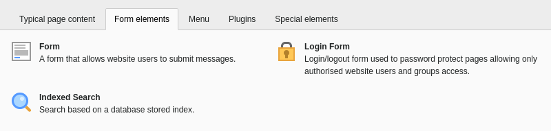
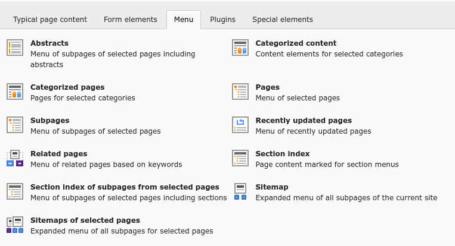
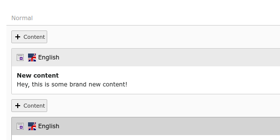

.. include:: /Includes.rst.txt

.. _content-creating:

================
Creating content
================

In the :guilabel:`Web > Page` module, on any page, click the :guilabel:`"+
Content` icon where you want to insert content.

This action displays the **Create new content element** window. The
content elements that are available depends on the setup of your TYPO3
installation, and any extensions that may be installed.

.. _content-types:

Types of content elements
=========================

If you are working with the `Introduction Package <https://extensions.typo3.org/extension/introduction/>`__, you will see more
content elements than described here. That's because the *Bootstrap Package*
it comes with has several content elements of its own.

This page describes the TYPO3 Core content elements.

.. _content-typical:

Typical page content
--------------------

Insert regular text and image content types to build standard web pages.

.. figure:: ../../Images/NewContentWizardTabTypical.png
   :alt: The Typical Page Content tab of the new content element window
   :class: with-border

.. _content-form:

Form elements
-------------

Create a login form or a simple contact form.

.. _content-menu:

Menu elements
-------------

Present a menu or list of page links in different ways.

.. _content-plugin:

Plugins
-------

Plugins are provided by extensions. Not all plugins are available on this tab.
It depends on their architecture or on backend configuration. In some cases
you insert the General Plugin content element, then go to the **Plugin** tab
to select a specific plugin.

.. figure:: ../../Images/NewContentWizardTabPlugins.png
   :alt: The Plugins tab of the new content element window
   :class: with-border

.. _content-special:

Special elements
----------------

Insert plain HTML, or a horizontal divider on the page. The "Insert records"
element lets you reference other content elements, so you can reuse content
from another page without duplicating it.

.. figure:: ../../Images/NewContentWizardTabSpecial.png
   :alt: The Special Elements tab of the new content element window
   :class: with-border

.. _content-new-element:

Add new content to a page
=========================

#. On a page, click the :guilabel:`"+ Content` icon where you want to insert
   content.
#. On the **Typical Page Content** tab, choose the "Text & Media" element.
   This is the most commonly used content type. The **Create new Page
   Content** screen displays.

.. figure:: ../../Images/NewContentElement.png
   :alt: Empty input form for a Text & Media content element
   :class: with-border

#. In the :guilabel:`Header` field, type *New content*.
#. In the :guilabel:`Text` area, type some content. This field uses a
   :ref:`Rich Text Editor<rte>` (RTE).

#. Save and close the content element.
   You can see the newly added element on the page:

