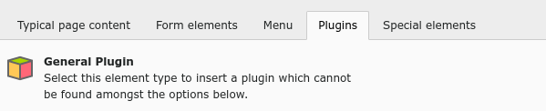

.. include:: ../../Includes.txt

.. _content-creating:

================
Creating Content
================

Click any of the "Add content" icons. You will then be presented
with a wizard for choosing the type of content element that you
want to add to your page. This list may vary depending on your
setup and on extensions that may be installed.

We will take this opportunity to briefly go through the
various types of content elements as needed. The wizard
itself already provides mostly self-explanatory descriptions.

.. tip::

   **Advanced topic:** this whole wizard is configurable using
   so-called :ref:`Page TSConfig <t3tsconfig:pagenewcontentelementwizard>`.

.. _content-types:

Types of content elements
=========================

.. _content-typical:

Typical Page Content
--------------------

.. _content-form:

Form Elements
-------------

.. figure:: ../../Images/NewContentWizardTabForm.png
   :alt: The Form Elements tab of the new content element wizard

.. _content-menu:

Menu Elements
-------------

.. figure:: ../../Images/NewContentWizardTabMenu.png
   :alt: The Menu Elements tab of the new content element wizard

.. _content-plugin:

Plugins
-------

Plugins are provided by extensions. Not all plugins appear
in this tab. It depends on their architecture or on backend
configuration.

.. _content-special:

Special Elements
----------------

.. figure:: ../../Images/NewContentWizardTabSpecial.png
   :alt: The Special Elements tab of the new content element wizard

The "Insert records" element is used to make references to
other content elements. This way you can reuse content in
an other page without duplicating it.

.. _content-new-element:

Creating a new content element
==============================

Go back to the "Typical Page Content" and choose "Text & Media",
which is probably the most used content type. You should see the
following input form:

.. figure:: ../../Images/NewContentElement.png
   :alt: Empty input form for a Text & Media content element

The most important fields are the "Header", which is going to be the
title of your content element, and the "Text", which will be the
content itself. This field uses a Rich-Text Editor (RTE), which
is :ref:`described in more details later <rte>`.

We will not look at the other fields in detail just yet.
For now please enter some text in both the "Header" and "Text"
fields, save your work and hit the "Close" icon, so that we get back to
the *Page* module. You should be able to see your new content:

.. figure:: ../../Images/NewContentElementSaved.png
   :alt: The new content element appears in the Page module
