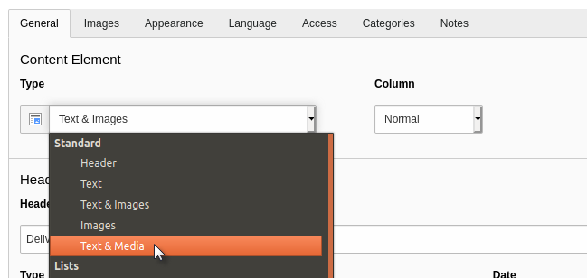

.. include:: /Includes.rst.txt

.. _content-editing:

Editing Content
^^^^^^^^^^^^^^^

Editing is basically the same as creating new content, except
that your input form is already filled with the existing data.

First off, we will change the type of content element, since
this is what is causing errors in the frontend. So click the
"Edit" icon of your new content element.

Open the "Type" selector and choose "Text & Images". The following
dialog box will appear:

.. figure:: ../../Images/EditContentChangeTypeConfirm.png
   :alt: Editing a content element to change its type

When you change a content element's type, TYPO3 CMS will reload
the input form to display different fields. This is why it is
asking for confirmation about saving before the reloading happens.

Change the text you entered before and use the "Save and view page"
action to save your changes and preview them in the frontend.
