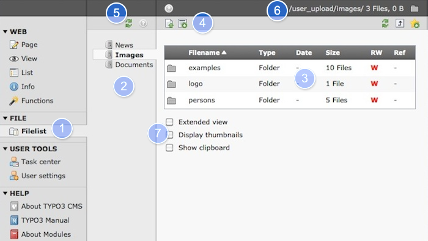
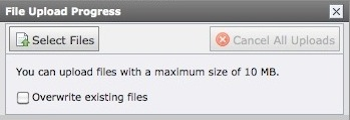
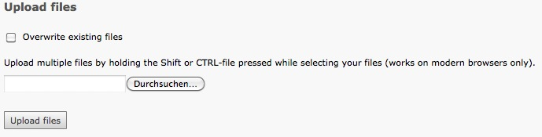
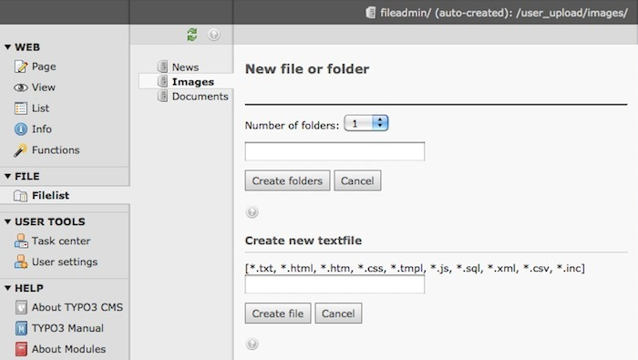

.. ==================================================
.. FOR YOUR INFORMATION
.. --------------------------------------------------
.. -*- coding: utf-8 -*- with BOM.

.. include:: ../../Includes.txt

.. _files:

Working with Files
^^^^^^^^^^^^^^^^^^

If you want to include files in your website, first upload them to
your web server.

TYPO3 provides the  **filelist** module which can be used to store and
browse files on the server. The files which are stored this way are
**available in the link section of the rich text editor** and **in
the image section** of content elements.

#. Select the  **filelist** module.

#. Where you saw the page tree when you where in the modules in the
   category Web (e.g. in the page module), there now is the **filetree**.
   Here you might see one or more folders.

#. This is the  list of files and folders inside the selected folder. Clicking
   on the file icon pops up a menu, clicking on the name opens the file.

#. **Upload files** to this folder or create empty folders and files.

#. Reload the filelist.

#. Your actual working directory.

#. Activating **Display thumbnails**, **Extended view** or **Show Clipboard**
   permanent.

Dialog to upload multiple files, with the **flash uploader** enabled in your
personal settings (default).

Dialog to upload multiple files, if the Flash Uploader is disabled.

Dialog to create empty folders and files.

