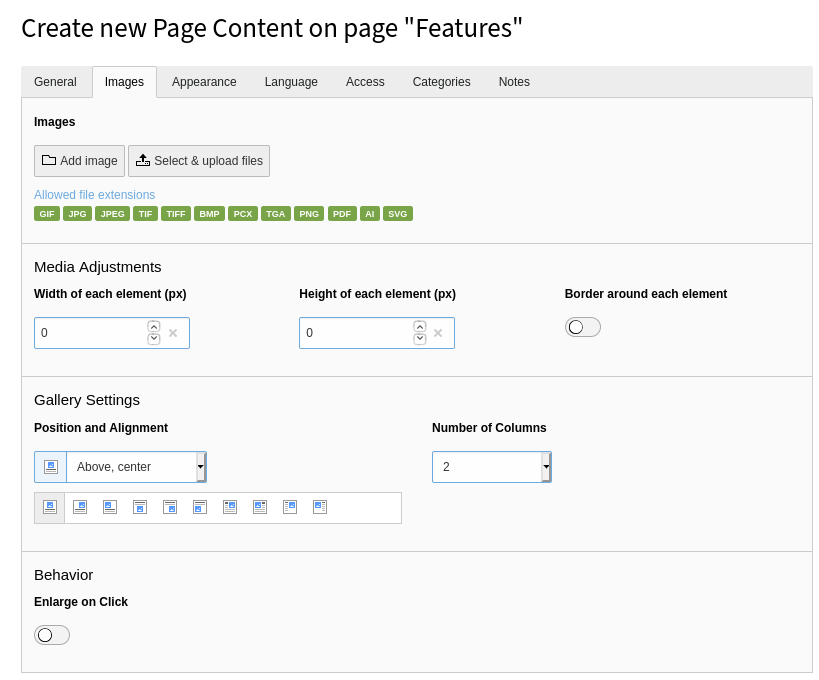
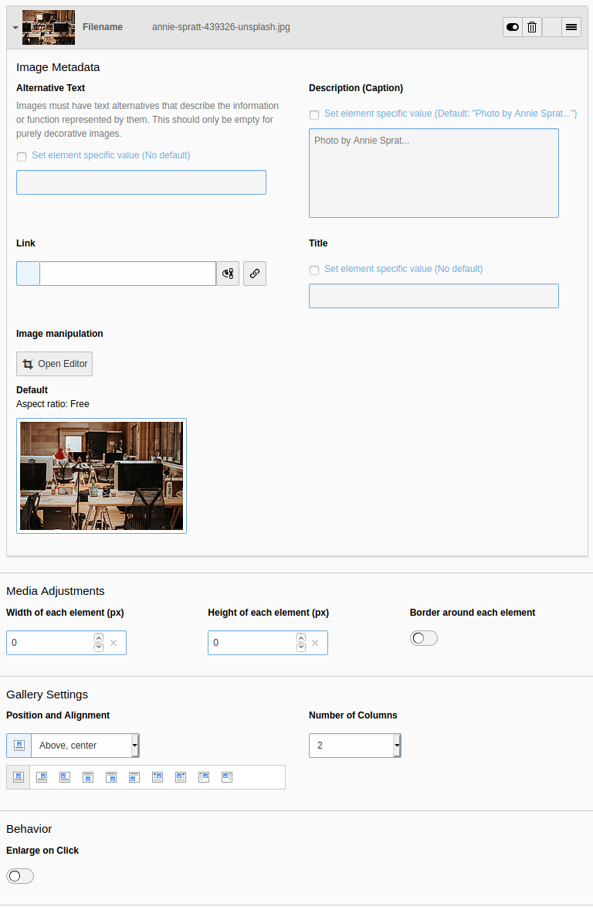

.. include:: /Includes.rst.txt

.. _images-new:
.. _images:

===================
Working with images
===================

For content elements that support images (for example, Text & Images, Text &
Media, Images Only), you will see an **Images** tab when you create or edit
the content element.

It is best practice to add new images using the :guilabel:`File > Filelist`
module, which is covered in the :ref:`Getting Started Tutorial <t3start:the-file-module-or-image-archives>`. This method means files are centrally stored
and any information or metadata you add to the image is used wherever that
image is used on the site.
When you use the :guilabel:`Select & upload files` button, the image is
attached to the page, and any information or metadata is stored only for the
image use on this page.

.. _add-image-to-page:

Add an image to a page
======================

#. On the **Images** tab, click the :guilabel:`Add image` button. The **File
   selector** window displays to let you browse for an image.

   .. figure:: ../../Images/ManualScreenshots/Fileadmin/ImageSelector.png
      :alt: The window for selecting images
      :class: with-border

#. Browse the file tree then select a folder.
#. Tick the :guilabel:`Display thumbnails` box to show a preview of each image
   in the folder.
#. Click the name of an image to select it. Alternatively, click the
   :guilabel:`+` icon to select multiple images before closing the window.

.. _Configure-the-image:

Configure the image
===================

The **Images** tab lets you perform a number of actions to configure an image.

Image metadata
--------------

Use the small arrow next to the thumbnail to collapse and expand this section.

Here you can set general metadata including description and alt text, and
insert a link to the image.

If the file was added using the :guilabel:`File > Filelist`
module (which is best practice), the information displayed here is drawn from
the Filelist. If required, you can override this metadata to set specific
values for the image for the current content element.

You can experiment with the image manipulation editor to crop or resize the
image. Making changes here won't impact the original image file in Filelist.

.. _images-appearance:

Media adjustments
-----------------

Manually specify the width and height of the image in pixels, and apply a
border.

Gallery settings
----------------

Choose where to position the image in relation to the text.

Images are automatically arranged in columns, two by two. You can change this
behaviour with the :guilabel:`Number of Columns` field.

Behavior
--------

Use the :guilabel:`Enlarge on Click` setting to link the image
will be linked to the original file in a lightbox display.
