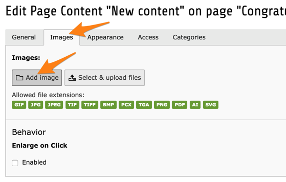
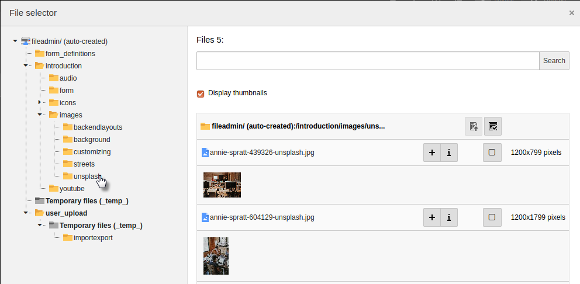
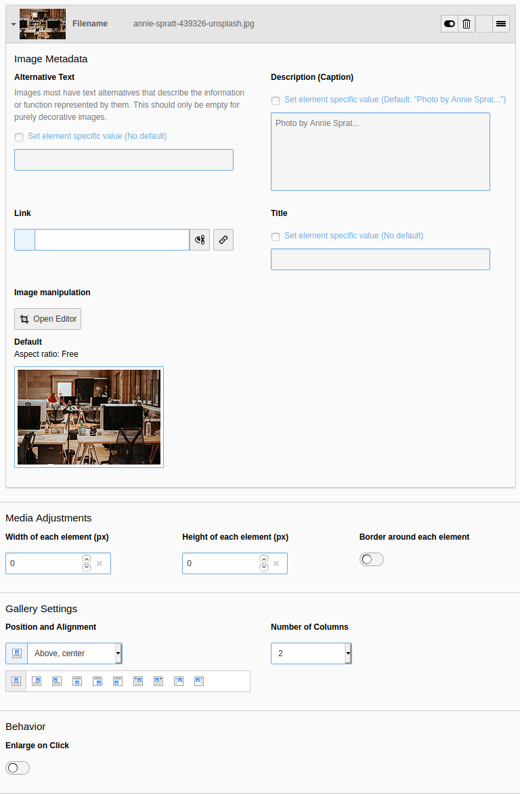

.. include:: ../../Includes.txt

.. _images:

Working with Images
^^^^^^^^^^^^^^^^^^^

Since we are working with a "Text & Images" content element,
let's add images to it!

Move to the "Images" tab.

Clicking the "Add image" button will open a window for selecting
an image.

Navigate the file tree to get to the :file:`examples` folder.
Clicking on it will trigger the display of the files it contains
in the right part of the window. You may want to check the
"Display thumbnails" box to get a preview of each image.

You have two ways of selecting an image. Clicking on its name
will select the image and close the window. Clicking on the "+"
icon will only select the image, making it possible to select
multiple images before closing the window.

Once you are back in your content element, you can perform
a number of actions or configure the image further.

First of all some information is display about the image (1):
thumbnail and file name. The arrow next to the thumbnail is used
to collapse the display of the image details.

A series of icons (2) let you act the image or its relation to the content element:

- The "Edit" icon lets you edit the chosen image's metadata.
  Beware as this might impact other places where the image is used.

- The "Delete" icon will remove the image from the content element,
  not delete the image itself.

- The "Move" icon (rightmost) is used by dragging and dropping for
  changing the order of images

The central area (3) lets you edit the image's metadata with
regards to its current relation to the content element. If you
check the corresponding "Override?" boxes, you can set a specific
title, alternative text and caption for the relation of that image
to the current content element.

You can experiment with the image editor (4), which will let you
crop the image.

Finally if you check the "Enlarge on click" box (5), the image
will be linked to the original file in a lightbox display.

.. _images-appearance:

Image appearance
""""""""""""""""

Moving the "Appearance" tab of the content element, you can set further
behaviors of the images attached to the content element.

.. figure:: ../../Images/EditContentAppearance.png
   :alt: Changing the appearance of images

In "Image Adjustments" you can choose to apply a border or a
special effect to the images. You can also choose a specific
quality for these images.

In "Image Alignement" you can choose where the images should
be positioned with regards to the text. Images are automatically
arranged in columns, two by two. You can change this behaviour
with the "Number of Columns" field.

.. _images-new:

New images
""""""""""

New images can be added using upload buttons found in the
image selector window or by using the **FILE > Filelist**
module.

Usage of the *Filelist* module is covered in the
:ref:`Getting Started Tutorial <t3start:the-file-module-or-image-archives>`.
