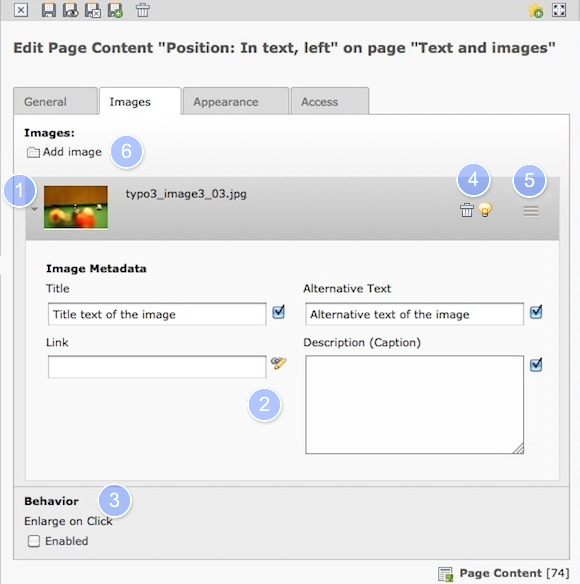
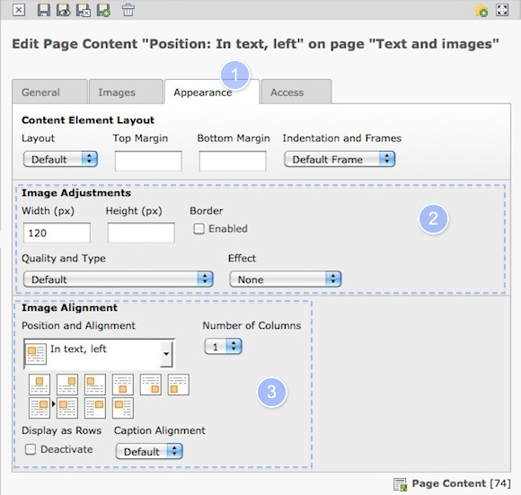

.. ==================================================
.. FOR YOUR INFORMATION
.. --------------------------------------------------
.. -*- coding: utf-8 -*- with BOM.

.. include:: ../../Includes.txt

.. _images:

Working with Images
^^^^^^^^^^^^^^^^^^^

Most times you work with images either in the "text with image" or the
"images only" content element. Both cases are covered here. For
working with images it can be helpful to activate the option  **Show
secondary options** at the bottom of the page with the edit form.

#. Image currently visible in the content element, open arrow for details.

#. If you want to have a **caption**, **Title** or **alternative text** put it in here, or
   turn the image into a **link.**

#. Make the  **fullscreen size** of an image available.

#. You may **hide** or **remove** an image

#. Select an image on the left and  **change the order** with drag and drop.
   (For more than one images only)

#. To  **add an image from the filelist** on the server, use this folder
   button. For more information on the filelist see the following
   section.

You will also see a text area for  **Alternative Text** and **Title**. It is
generally a good idea to write a couple of words describing each
picture in one line each. This is especially important for
accessibility requirements (for example, Section 508 compliance in the
US).

#. Choose the tab **appearance**.

#. Set a specific **width and / or height** for all images in this
   element. Mostly it's sufficient to define the width, TYPO3 will scale the image
   proportional into the required size.

#. **Place the images** relatively to the text.
