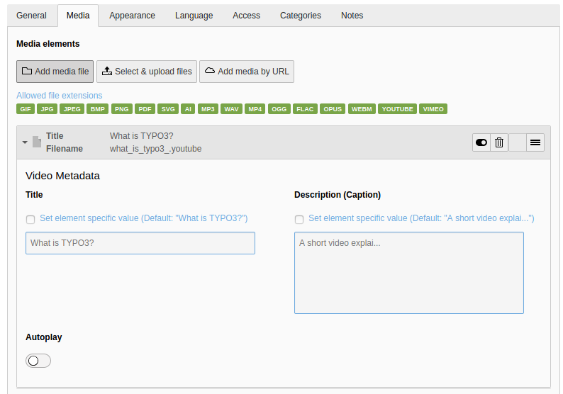

.. include:: /Includes.rst.txt

.. _media:

=========================
Embedding video and audio
=========================

Like images, it is best practice to add new video and audio files using the
:guilabel:`File > Filelist` module, which is covered in the :ref:`Getting Started Tutorial <t3start:the-file-module-or-image-archives>`. This method
means files are centrally stored and any information or metadata you add to
the file is used wherever that media file is used on the site.

When you use the :guilabel:`Select & upload files` button, the media file is
attached to the page, and any information or metadata is stored only for use
on this page.

.. _add-video-to-page:

Add a video to a page
=====================

On the **Media** tab, click the :guilabel:`Add media file` button, then follow
the same process as you would to :ref:<add-image-to-page>.

Alternatively, you can click the :guilabel:`Add media by URL` button to paste
a link to a video or audio file from the web.

.. _Configure-the-video:

Configure the video
===================

Use the :guilabel:`Autoplay` setting to specify whether the video should
start playing as soon as the page loads.

You can configure various settings for media files (for example, adding a
border, setting page position and behavior) just as you would to
:ref:`configure an image:Configure-the-image`.
