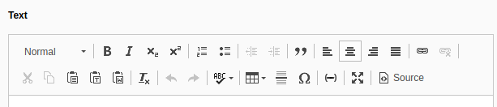
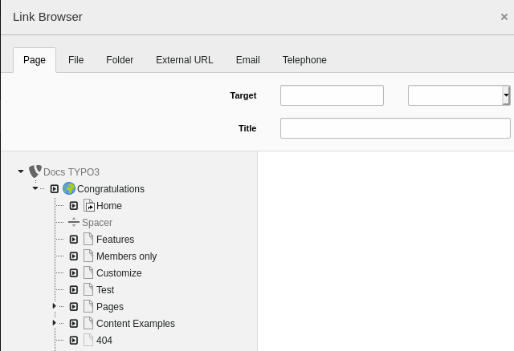

.. include:: /Includes.rst.txt

.. _rte:

The Rich Text Editor
^^^^^^^^^^^^^^^^^^^^

The editor will certainly feel familiar as it is not much
different from a word processor. The options available in the
toolbars will vary depending on how the installation was
set up.

One particular feature is linking. Once you have selected some text
you can click on the icon highlighted above to create a link.

.. _rte-linking:

Creating a Link
"""""""""""""""

Clicking on the "Link" icon will open a dialog box for selecting
what you want to link to. This is called the "link browser".

The link browser enables you to make links to pages, files and folders
or an external URL or an email address. The "Page" tab (1) should be active
by default.

Expand the page tree until you see the "About > TYPO3" page (2), then click
on the small arrow to the right of the page (3). This will trigger the display
of the content elements located on that page in the right half of the
window.

Click on the "TYPO3 - The Enterprise CMS" element (4) to create a
link to that element. This will automatically create a link including
an anchor pointing to that content element (TYPO3 CMS automatically
places anchors on each content element when rendering).

You could also have clicked on the "TYPO3" page (2) to create
a link to that page without targeting a specific content element.

Save and view your work in the frontend. There should be a hyperlink
to your selected target page.
