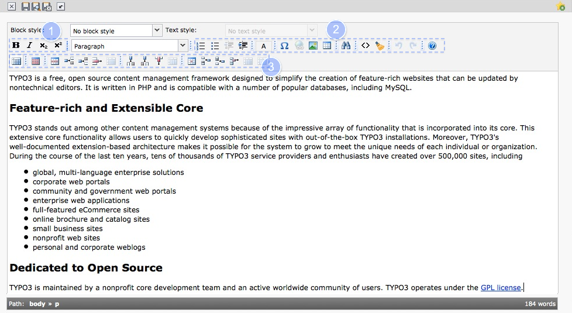
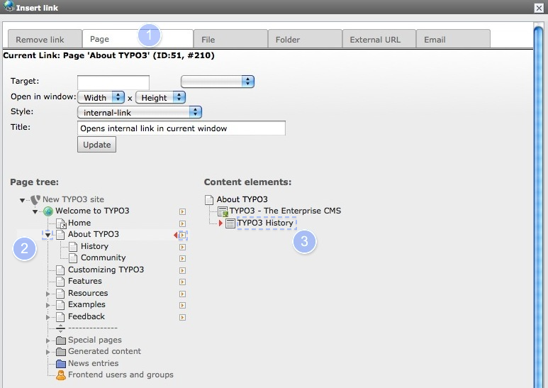

.. ==================================================
.. FOR YOUR INFORMATION
.. --------------------------------------------------
.. -*- coding: utf-8 -*- with BOM.

.. include:: ../../Includes.txt

.. _rte:

The Rich Text Editor
^^^^^^^^^^^^^^^^^^^^

The editor is pretty much self explanatory, you have probably worked
with similar word processing software before. Depending on how the
site was set up, the buttons available to you will vary. Here's an
example - move your cursor over the icons to see the tool tips.

Copy/Paste clipboard with (ctrl + C) or (ctrl + V)

Common  **Rich Text Editor** (RTE) formatting options include:

#. **bold**, *italic*, :sup:`super` and :sub:`sub` script

#. type of lists, indentation, special characters, link tool, insert picture, insert table, search and replace, view source, remove format, undo/redo last changes

#. toggle borders for tables, table manipulation

.. _rte-linking:

Creating a Link
"""""""""""""""

Once you have selected a word or more in the rich text editor and
clicked on the **Link** icon, you have the following options:

#. To insert a link to **page within your website** , just click on the **page** tab.

#. Open the page tree (click on the small black arrow)

#. Insert an anchor to the titel of an specific content element (click on the small red arrow)

If you have selected an existing link, you can use the Link icon to
edit the link. With the leftmost option, **Remove Link**, you can
remove the link.

Use the additional tabs to

- Remove actual link
- Link to an internal file in the filelist
- Link to an internal folder
- Link to an external target
- Link to an email address

