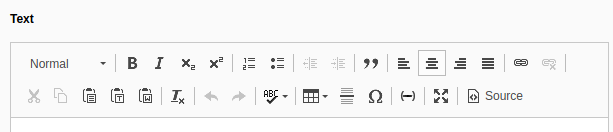
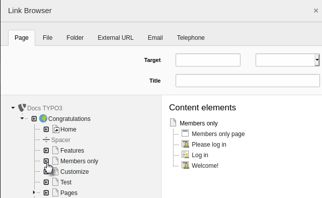

.. include:: /Includes.rst.txt

.. _rte:

====================
The rich text editor
====================

The TYPO3 text editing interface is not much different from a word processor.
The options available in the toolbars vary depending on how your TYPO3
installation is configured.

You can format text, set the alignment, insert tables and symbols and add
internal and external links to text.

.. _rte-linking:

Creating a link
===============

#. Select the text you want to link.
#. Click the :guilabel:`Link` icon in the toolbar.
   The **Link Browser** window displays.

   .. figure:: ../../Images/ManualScreenshots/Link/LinkBrowser.png
      :alt: The TYPO3 CMS link browser
      :class: with-border

This window lets you link to an internal page, file, folder, external
URL, email address or phone number.

Internal links
--------------
You can link to an internal file, folder, page or content element on a page.

On the **Page** tab, select the page in the page tree that you want to link to.

Alternatively, you can link to a specific point (anchor) on the page. Browse
to the page you want to link to, then click the arrow icon next to the page
name. The content elements on that page are displayed and you can select the
content element you want to link to.

The **Link Browser** window closes and the link is added to your text.

External links
--------------

#. In the **Link Browser** window, go to the **External URL** tab.
#. Type your link in the :guilabel:`URL` field.
#. In the Target drop-down list, select :guilabel:`New window` to open the
   link in a new browser window.

   .. figure:: ../../Images/ManualScreenshots/Link/LinkBrowserExternal.png
      :alt: Display the anchors on a page
      :class: with-border

#. Click the :guilabel:`Set Link` button to close the **Link Browser** window.

Removing a link
===============

To remove a link from text, put your cursor anywhere in the linked text then
click the :guilabel:`Unlink` icon on the toolbar.
