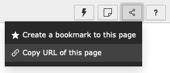
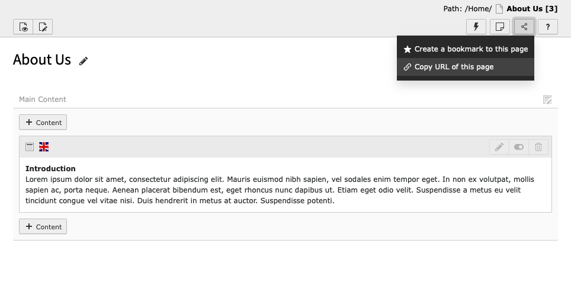
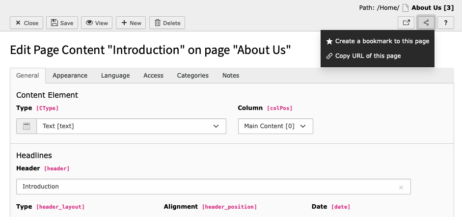
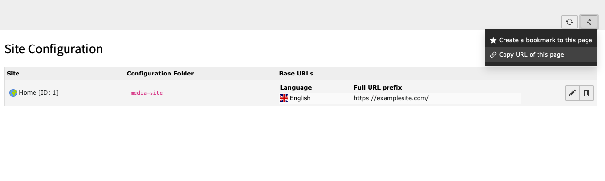

.. include:: /Includes.rst.txt

.. _deeplinking:

============
Deep Linking
============

Deep linking allows users to share links to specific pages, content elements and modules
from within TYPO3's backend.

For example, a user could be writing content for a new page that is about
to be published. Using deep links, they can share a link to the page
they are working on or even share a link to the actual content element that contains
their work and send it to another member of the team for review.

.. _deeplinking-sharing:

Sharing links
=============

To share a link, look for the :guilabel:`Share` icon located at the top right hand side of any
page in the backend.

Linking to a page
-----------------

The example below would create a deep link to the `About Us` page:

Linking to a content element
----------------------------

This example would a create a deep link to the `Introduction` content element, found
on the `About Us` page:

Linking to backend modules
--------------------------

It is possible to create links to places within backend modules. This example would create a link
to the `Site Configuration` module.

.. _deeplinking-bestpractices:

URLs and deep links
===================

When creating links to anything in the backend, it is recommended that the
:guilabel:`Share` button is used to generate the link. Copying the URL from the browser
is not recommended.
