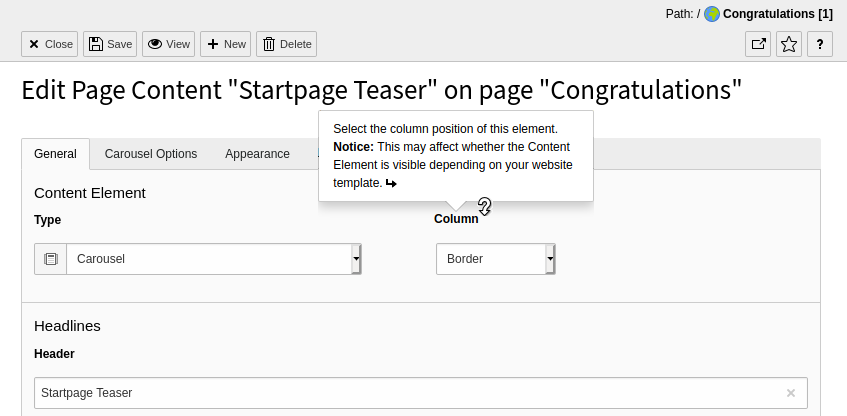
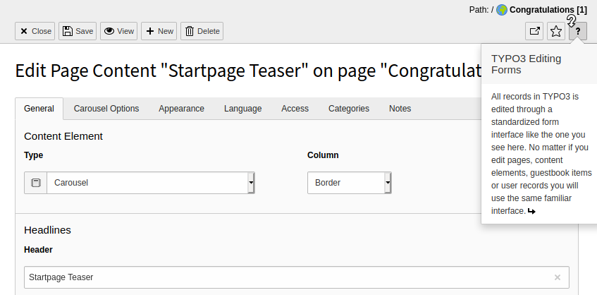

.. include:: /Includes.rst.txt

.. _help-inside:

=====================
Help within TYPO3 CMS
=====================

There are several features built-in to the user interface of the backend to help guide you when using the TYPO3 CMS.

Tooltips
========

Hover your mouse pointer over buttons and icons to display a short description of the function.

.. figure:: ../Images/Tooltip.png
   :alt: Tooltip

   See the Tooltip help for the Forms module

Context Sensitive help
======================

When you hover your mouse pointer over some field labels, your cursor changes into a question mark. This indicates that you can click on the label to display a help pop-up.

Most content elements include a **question mark icon**. Click the icon to display a help window about the item or function it is next to.

TYPO3 Manual
============

The TYPO3 Manual is a module that provides more extensive descriptions of features and functions in the backend.

In the top bar, click the question mark icon to access the Help section, then select the **TYPO3 Manual** module.

.. figure:: ../Images/Typo3Manual.png
   :alt: Various help features in the TYPO3 CMS backend

   Accessing the **TYPO3 Manual**
