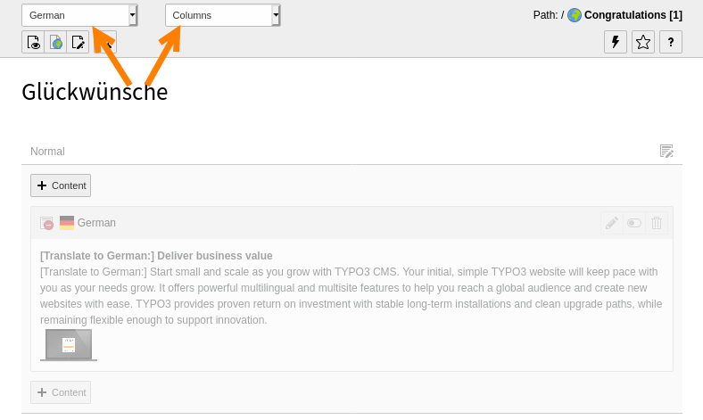

.. include:: /Includes.rst.txt

.. _languages:

======================
Working with languages
======================

TYPO3 CMS comes with the built-in ability to handle web sites
in multiple languages.

Detailed information about setting up a multilingual web site is
found in the :ref:`Frontend Localization Guide <typo3/guide-frontendlocalization:start>`.

..  youtube:: XzKBdjUV53k

------------

.. _languages-new:

Defining a new language
=======================

Languages are defined per site.

Adding a new language is done in the :guilabel:`Site Management > Sites`
module, which is restricted to admin users. Detailed information on how to
configure your site to add more languages can be found in the :ref:`Site
Handling <t3coreapi:sitehandling-basics>` documentation.

The `Introduction Package's <https://extensions.typo3.org/extension/
introduction/>`__ default languages are English, Danish and German languages.

.. _Translation-modes:

Translation modes
=================

When you choose to translate content, TYPO3 offers two methods:

*  :guilabel:`Translate` - Use this option when you have a strict translation workflow
   or content structure.

   TYPO3 will create a direct connection between the
   original language and the translation. When the original language content
   is changed, the translations are marked as out-of-date and you can see the
   changes in the original language when editing a translation.

   This mode means that TYPO3 can help you maintain consistency when you have
   separate teams localizing content. This mode also allows TYPO3 to
   automatically mark translated content for review, and notify translators
   when the original text changes.
*  :guilabel:`Copy` - Use this option when you would like the content structure to be
   free and independent between languages.

   TYPO3 creates a copy of the content in the target language. No connection
   is maintained between the original and the translation, which means
   subsequent versions of the translations can easily diverge from the
   original.

.. _languages-translations:

Working with translations
=========================

#. Working with the `Introduction Package <https://extensions.typo3.org/
   extension/introduction/>`__, in the :guilabel:`Web > Pages` module, go to the "Congratulations" home page.
#. Using the menu in the docheader, switch to the "Languages" view.

   .. figure:: ../Images/ManualScreenshots/Language/LanguagesPageLanguages.png
      :alt: The "Languages" view of the Content Layout module
      :zoom: gallery

#. In the drop-down menu "Create a new translation of this page", choose a
   language, let's say German in this case. The page properties displays for
   the German version of the page.
#. Type the German translation in the :guilabel:`Page Title` field.

   .. figure:: ../Images/ManualScreenshots/Language/LanguagesNewPageTranslation.png
      :alt: Creating a new page translation
      :zoom: gallery

#. Save and close the page. The screen now displays two versions of the content
   elements showing the default language and the German version side by side.

   .. figure:: ../Images/ManualScreenshots/Language/LanguagesPageVersions.png
      :alt: Viewing languages side by side in the page module
      :zoom: gallery

#. In the German column, click the :guilabel:`Translate` button for a content
   element. The :guilabel:`Localize` wizard displays.

   .. figure:: ../Images/ManualScreenshots/Language/LanguagesTranslateContentElementsStep1.png
      :alt: First step of the Localize wizard
      :zoom: gallery

#. For this example, click the :guilabel:`Translate` button then click
   :guilabel:`Next`.
   Step 2 of the wizard will pass by automatically since we are translating in
   a single language.
   Step 3 provides a summary of the elements that will be translated.
#. Click :guilabel:`Next` to complete the wizard.

   The German version of the content element is now prepended with *[Translate
   to German:]*. The element is hidden by default, so that incomplete
   translations aren't displayed on the frontend until you are ready.

   .. figure:: ../Images/ManualScreenshots/Language/LanguagesNewContentTranslation.png
      :alt: A newly created content element translation
      :zoom: gallery

      A newly created content element translation

.. _Adjusting-the-View:

Adjusting the view
==================

The *Page* module may now seem cluttered, with one column for each
translation. You can view a single language at a time by switching back to the
"Columns" mode and choosing a specific language in the docheader.

   The "Columns" mode displaying a translation

.. _next-steps-l10n:

Next steps
==========
The :ref:`Frontend Localization Guide <typo3/guide-frontendlocalization:start>`
contains detailed information about setting up a multilingual web site and how to
actually do the translation and localization.

The :ref:`Site Handling <t3coreapi:sitehandling-basics>` documentation contains
information about how to configure your site to add more languages.
