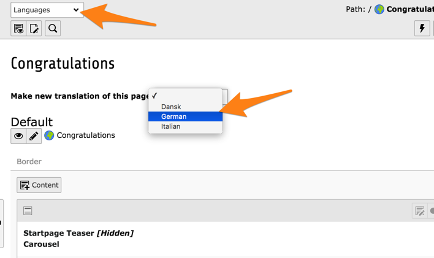
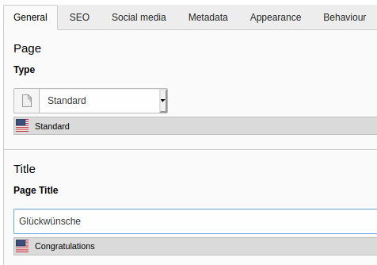
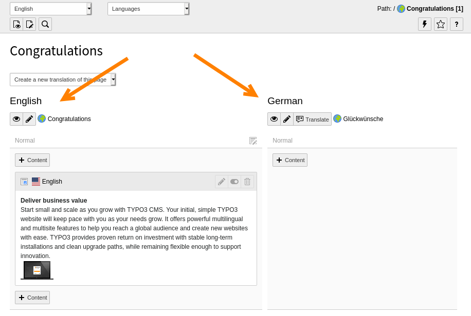
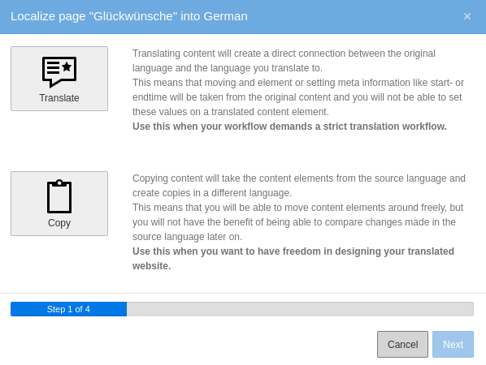
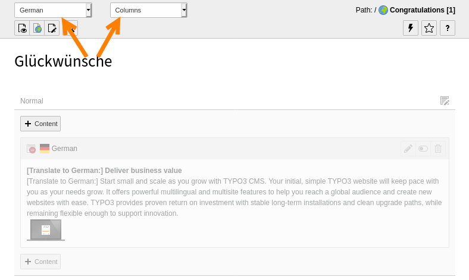

.. include:: ../Includes.txt

.. _languages:

Working with languages
----------------------

TYPO3 CMS comes with the built-in ability to handle web sites
in multiple languages.

.. _languages-new:

Defining a new language
^^^^^^^^^^^^^^^^^^^^^^^

Languages are defined in the site configuration on a per-rootpage
basis. When creating a new page on root level via TYPO3 Backend,
a very basic site configuration is generated on the fly.
It prevents immediate errors due to missing configuration and can
also serve as a starting point for all further actions.

The Introduction Package's default languages are English, Danish
and German languages. Adding a new language is done in the
"Sites" module, which is restricted to admin users.

.. tip::

   Detailed information on how to extend the site configuration
   with additional languages can be found in the
   :ref:`Site Handling Documentation <coreapi:sitehandling-basics>`.

.. _languages-translations:

Working with translations
^^^^^^^^^^^^^^^^^^^^^^^^^

Move to the **WEB > Pages** module and to the "Congratulations"
home page. Using the menu in the docheader, switch to the
"Languages" view.

Use the menu entitled "Make new translation of this page" to
create a new translation. Choose the language from the dropdown,
let's say German in this case. You will be presented with an
input form for the page translation (so-called "Alternative
Page Language"):

Just enter the translation in the "Page Title" field and save changes.
Back in the *Page* module, we can now see the default language and the
German version side by side.

The *Page* module makes it possible to easily copy content elements
in the new language by hitting the "Translate" button. Do so now
for the "Border" content area and you should see the following:

The translations can either be linked together or unrelated.
As explained by the wizard the strict mode should be used when
every content in the default language is meant to be translated
so that every translation is strictly related to an element in the
default language. The "copy" mode will also create a copy but it
will be unrelated to its original source. This should be preferred
when web site translations will diverge from the default language.

For this example, click on the large "Translate" icon and then
on the "Next" button. Step 2 of the wizard will pass by automatically
since we are translating in a single language. Step 3 provides
a summary of the elements that will be translated. Hit the
"Start processing" button to get started. You should see the
following result:

.. figure:: ../Images/LanguagesNewContentTranslation.png
   :alt: A newly created content element translation

You can observe how the new element's content has been prepended
with *[Translate to German:]*. Also note that it is hidden by
default, so that incomplete translations don't turn up on the
web site.

.. figure:: ../Images/LanguagesTranslatedContentElement.png
   :alt: A translated content element, with reference to its original

You can see how the new content element is related to the one
in the default language (in the field "Transl.Orig"). Under
most fields is also an indication of the content in the default
language.

The *Page* module may now seem cluttered, with one column per existing
translation. It is possible to view a single language at a time
and with the original layout, by switching back to the "Columns"
mode and choosing a specific language in the docheader.

.. tip::

   Detailed information about setting up a multilingual web site is
   found in the :ref:`Frontend Localization Guide <t3l10n:start>`.
