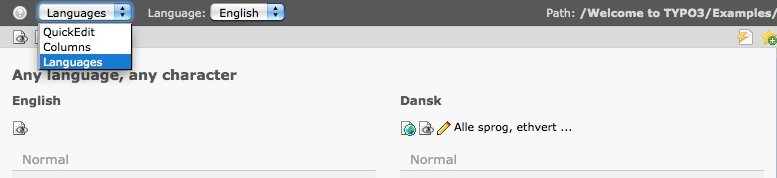

.. ==================================================
.. FOR YOUR INFORMATION
.. --------------------------------------------------
.. -*- coding: utf-8 -*- with BOM.

.. include:: ../Includes.txt

.. _languages:

Working with Languages
----------------------

If your site is available in multiple languages, you want to have
different translations of the same page. Here is what you need to do:

In the top part of the  **Page module**, you have a drop-down box,
where you select the  **Languages** option.

If you want to translate an existing page you will click the
button **Make new translation of this page** with a drop-down
menu of the available languages. Choose the one you want, in our
example the available language is "dansk".

.. figure:: ../Images/languages_img2.png
   :alt: Languages

Then enter the new translation of the page name in the field
**Pagetitle** and save.

.. figure:: ../Images/languages_img3.png
   :alt: Languages

Now you can **copy the content of the page in the source language**
to the new language. This is quite useful, if you have content
which you would like to see in the version of the new language as
well. You can also **create an entirely new version** of the page.

.. figure:: ../Images/languages_img4.png
   :alt: Languages

Now you are prepared to work on the translation of the content at any
content element starting with *[Translate to "new language"]*. (Replace
New Language with "Dansk" in our example)

.. figure:: ../Images/languages_img5.png
   :alt: Languages

If this two column mode is a little confusing, you can go back to the
old view of the work area by selecting **Columns** in the dropdown
menu, where you previously selected Languages.
Note that you can now switch between the different translations of the
page with another drop-down menu below the one you just used.

