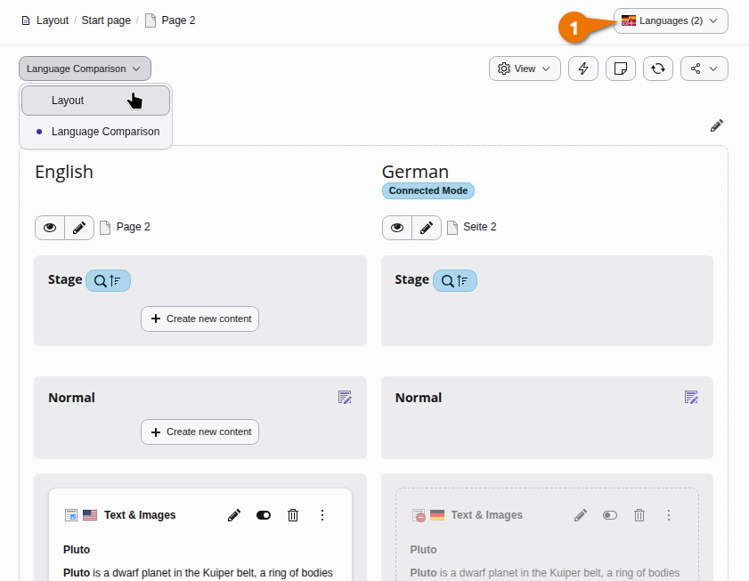

..  include:: /Includes.rst.txt

..  _languages:

======================
Working with languages
======================

TYPO3 CMS comes with built-in support for managing multi-language sites from a
single installation.

..  note::
    More detailed information can be found in the
    `Frontend Localization Guide <https://docs.typo3.org/permalink/t3translate:start>`_.

..  youtube:: XzKBdjUV53k

------------

..  _languages-new:

Language Configuration
======================

Languages are managed at the site level. To add or configure languages for a
site, navigate to :guilabel:`Site Management > Sites`.

..  note::
    Managing site languages requires administrative privileges. For detailed setup
    instructions, see the :ref:`Site Handling <t3coreapi:sitehandling-basics>`
    documentation.

..  _Translation-modes:

Translation strategies
======================

When translating your content, TYPO3 supports two distinct localization
workflows: a :ref:`connected <languages-translation-mode-connected>` and
an :ref:`independent <languages-translation-mode-copy>` mode

..  _languages-translation-mode-connected:

Translate (connected)
---------------------

Use this mode if your site requires a strict, parallel content structure across
all languages. TYPO3 maintains a direct link between the source element and its
translation.

*   Out-of-date flags: Updates to the source text automatically flag
    translations as out-of-date.
*   Side-by-side editing: Editors can view original source changes while
    updating the translation.
*   Review workflows: Supports automated notifications and review tracking for
    localization teams.

..  _languages-translation-mode-copy:

Copy (independent)
------------------

Use this mode if your localized pages require unique layouts, different content
structures, or completely independent text.

*   Decoupled content: TYPO3 creates a standalone copy of the source content in
    the target language.
*   Structural freedom: No link is maintained, allowing the localized page
    structure to diverge entirely from the source.

..  _languages-translations:

Localizing a page
=================

Follow these steps to translate a page and its content elements.

Create the page translation
---------------------------

#.  Navigate to the :guilabel:`Content > Layout` module and select the page you
    want to translate.
#.  Locate the :guilabel:`Create new translation` dropdown and select
    the target language that you want to translate into, making sure the target
    language has been configured in :guilabel:`Site Management > Sites`. This
    will open the translation wizard.

    ..  figure:: ../Images/ManualScreenshots/Language/PageLanguages.png
        :alt: Creating a translation of a page
        :zoom: gallery

#.  Click through the translation wizard, choosing a translation mode of
    :guilabel:`Translate` or :guilabel:`Copy`
    (see :ref:`Translation strategies <Translation-modes>`) for each content
    element on the page until you see :guilabel:`Localization completed`. The
    last screen of the wizard shows a summary of what will be translated.
    Click on the :guilabel:`Finish` button.

    ..  figure:: ../Images/ManualScreenshots/Language/LanguagesTranslateContentElements.png
        :alt: The translation wizard
        :zoom: gallery

#.  Click on :guilabel:`Language Comparison` (1). The screen now
    displays two versions of the page - the default language version on the left
    and the target language version on the right. Translate **page** fields such
    as the title by clicking on the pencil icon(2) and then typing in your
    translations. The new target language **content elements** are hidden in the
    frontend by default. **Enable**(3) each content element after you have
    finished translating its text.

    ..  figure:: ../Images/ManualScreenshots/Language/LanguagesPageVersions.png
        :alt: Viewing translated pages side by side in the content layout module
        :zoom: gallery

..  _Adjusting-the-View:

Changing the view
==================

Change the view from side-by-side pages to a single language by clicking on
:guilabel:`Layout` mode and then choosing the language you want to see(1).

    Buttons to change the view on multilingual pages

..  _next-steps-l10n:

Next steps
==========
The :ref:`Frontend Localization Guide <typo3/guide-frontendlocalization:start>`
contains detailed information about setting up a multilingual web site and how to
do translation and localization.

:ref:`Site Handling <t3coreapi:sitehandling-basics>` contains
information about how to add more languages to you site configuration.
