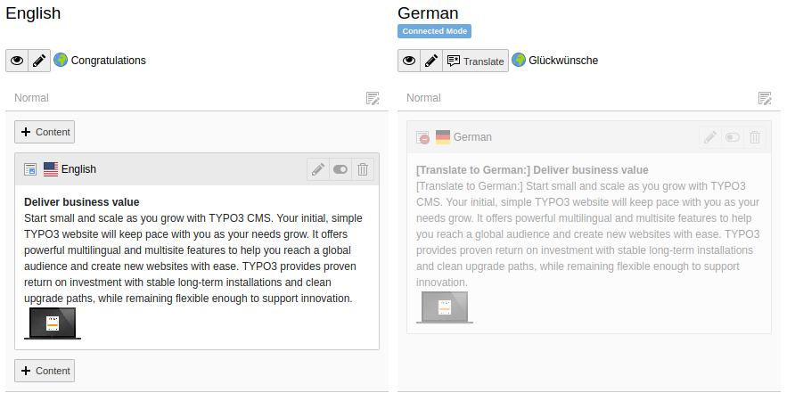

.. include:: ../Includes.txt

.. _languages:

Working with languages
----------------------

TYPO3 CMS comes with the built-in ability to handle web sites
in multiple languages.

.. _languages-new:

Defining a new language
^^^^^^^^^^^^^^^^^^^^^^^

The default language is never explicitely defined. It will be
whatever you choose it to be. Additional languages are first
created in the backend and can then be used to translate pages
and content elements.

The Introduction Package's default language is English and the
Danish and German languages are already defined. Adding a new language
is as easy as creating a new record for that, but it can strictly be
done only on the root page.

Use the **WEB > List** view and place yourself on the
"New TYPO3 Site" page. Scroll down a bit, until you see
the list of "Website Languages".

.. figure:: ../Images/LanguagesListExisting.png
:alt: List of existing web site languages

Click on the "New record" icon and define your new language.

.. figure:: ../Images/LanguagesNewLanguage.png
:alt: Setting up a new language

Give your new language a title, relate it to an official language
and choose a flag for it. Save and close, you're done.

.. _languages-translations:

Working with translations
^^^^^^^^^^^^^^^^^^^^^^^^^

Move to the **WEB > Pages** module and to the "Congratulations"
home page. Using the menu in the docheader, switch to the
"Languages" view.

.. figure:: ../Images/LanguagesPageLanguages.png
:alt: The "Languages" view of the Page module

Use the menu entitled "Make new translation of this page" to
create a new translation. Choose the language from the dropdown,
let's say German in this case. You will be presented with an
input form for the page translation (so-called "Alternative
Page Language"):

:alt: Creating a new page translation

Just enter the translation in the "Page Title" field and save changes.
Back in the *Page* module, we can now see the default language and the
German version side by side.

.. figure:: ../Images/LanguagesPageVersions.png
:alt: Viewing languages side by side in the page module

The *Page* module makes it possible to easily copy content elements
in the new language by hitting the "Translate" button. Do so now
for the "Border" content area and you should see the following:

:alt: First step of the translation wizard

The translations can either be linked together or unrelated.
As explained by the wizard the strict mode should be used when
every content in the default language is meant to be translated
so that every translation is strictly related to an element in the
default language. The "copy" mode will also create a copy but it
will be unrelated to its original source. This should be preferred
when web site translations will diverge from the default language.

For this example, click on the large "Translate" icon and then
on the "Next" button. Step 2 of the wizard will pass by automatically
since we are translating in a single language. Step 3 provides
a summary of the elements that will be translated. Hit the
"Start processing" button to get started. You should see the
following result:

:alt: A newly created content element translation

You can observe how the new element's content has been prepended
with *[Translate to German:]*. Also note that it is hidden by
default, so that incomplete translations don't turn up on the
web site.

.. figure:: ../Images/LanguagesTranslatedContentElement.png
:alt: A translated content element, with reference to its original

You can see how the new content element is related to the one
in the default language (in the field "Transl.Orig"). Under
most fields is also an indication of the content in the default
language.

The *Page* module may now seem cluttered, with one column per existing
translation. It is possible to view a single language at a time
and with the original layout, by switching back to the "Columns"
mode and choosing a specific language in the docheader.

.. figure:: ../Images/LanguagesColumnModeWithTranslation.png
:alt: The "Column" mode displaying a translation

