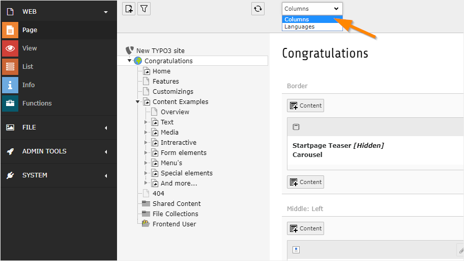
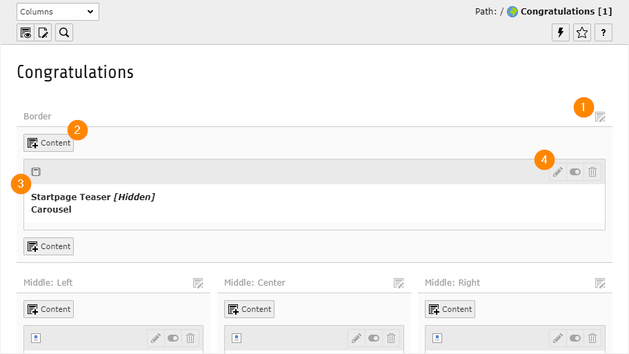
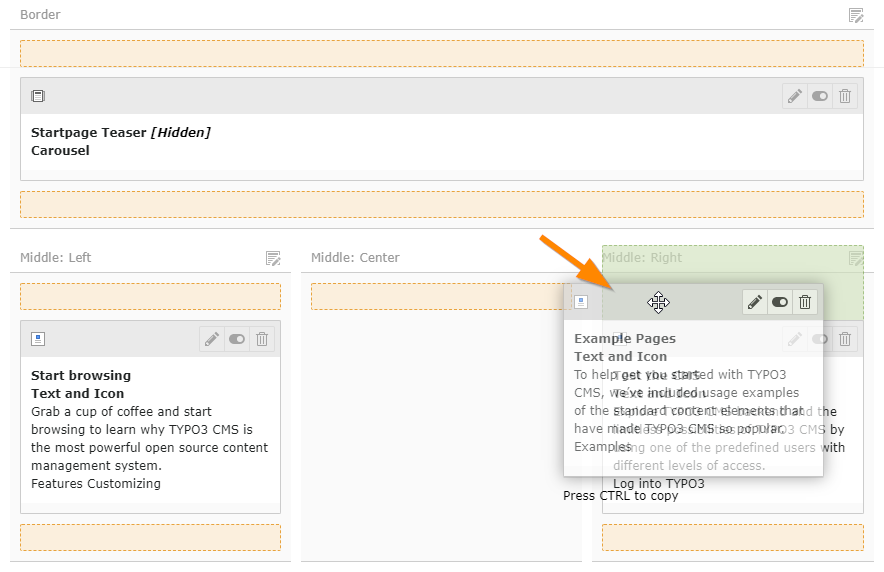

.. include:: /Includes.rst.txt

.. _content-working:

===============================
Работа с элементами содержимого
===============================

В TYPO3 работа с содержимым происходит в основном в модуле :guilabel:`Веб > Страница` / :guilabel:`Web > Page`.

Данный модуль работает в двух режимах: "Колонки" / "Columns" и "Языки" / "Languages". Дополнительно о режиме "Языки" смотрите в :ref:`Работа с языками<languages>`.

Сейчас нам нужен режим "Колонки" / "Columns". Для переключения режимов используйте меню в верхней части страницы.

На рисунке ниже показано, как выглядит главная страница Introduction Package во внутреннем интерфейсе TYPO3. Содержимое распределяется по различным областям страницы, они называются **колонки** / **columns**. Например, "Граница" / "Border", "Середина: Слева" / "Middle: Left", "Середина: Центр" / "Middle: Center" и т. д.

Многие значки затенены, чтобы упростить интерфейс. Некоторые значки вообще не отображаются при наведении курсора на определенные области.

Пояснения к распространенным значкам страниц:

#. С помощью этого значка можно редактировать все элементы содержимого колонки.

#. Добавляет новый элемент содержимого в колонку в данной конкретной позиции.

#. Значок элемента содержимого. Он дает визуальную подсказку о типе элемента содержимого. Щелкните, чтобы открыть контекстное меню элемента (для выполнения таких действий, как *копирование*).

#. Эта группа значков включается при наведении курсора на весь элемент.

   *  Для редактирования элемента используйте значок карандаша.
   *  Включить/выключить элемент, чтобы показать или скрыть его на сайте.
   *  Удаление элемента.

.. _content-working-moving:

Перемещение элементов содержимого
=================================

Элементы содержимого можно перемещать перетаскиванием.

Щелкните на серой полосе в верхней части элемента содержимого, а затем начните его перетаскивать. Выделенные области покажут, куда можно переместить элемент.

В модуле :guilabel:`Веб > Список` / :guilabel:`Web > List` можно перемещать элементы содержимого с одной страницы на другую путём вырезания и вставки. Информацию об использовании буфера обмена в модуле :guilabel:`Список` / :guilabel:`List` смотрите в главе :ref:`буфер обмена<clipboard>` / :ref:`clipboard<clipboard>`.
