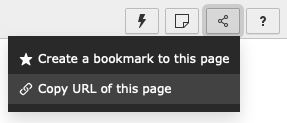
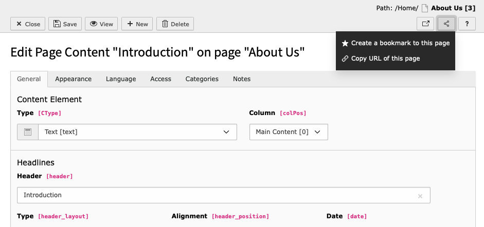
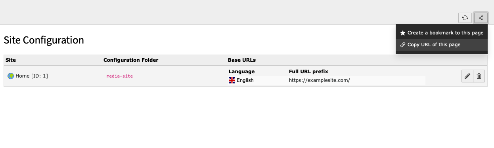

.. include:: /Includes.rst.txt

.. _deeplinking:

================
Внутренние связи
================

Возможность внутреннего связывания позволяет пользователям обмениваться ссылками на определенные страницы, элементы содержимого и модули из внутреннего интерфейса TYPO3.

Например, пользователь может создавать материалы для новой страницы, которая скоро будет опубликована. Используя внутренние ссылки, пользователь может поделиться ссылкой на страницу, над которой он работает, или даже поделиться ссылкой на элемент содержимого, с его работой, и отправить его на проверку другому представителю команды.

.. _deeplinking-sharing:

Обмен ссылками
==============

Чтобы поделиться ссылкой, найдите значок :guilabel:`Поделиться` / :guilabel:`Share`, расположенный в правом верхнем углу любой страницы внутреннего интерфейса.

Ссылка на страницу
------------------

В приведенном ниже примере будет создана внутренняя ссылка на страницу `About Us`:

.. figure:: ../Images/ManualScreenshots/DeepLinking/DeepLinkingPageLink.png
  :alt: Создание ссылки на общий доступ в модуле Страница
  :class: with-border

Ссылка на элемент содержимого
-----------------------------

В данном примере будет создана внутренняя ссылка на элемент содержимого `Introduction`, расположенный на странице `About Us`:

Связь с внутренними модулями
----------------------------

Существует возможность создания ссылок на места внутри модулей внутреннего интерфейса. В данном примере создается ссылка на модуль `Настройка сайта` / `Site Configuration`.

.. _deeplinking-bestpractices:

URL-адреса и внутренние ссылки
==============================

При создании ссылок на что-либо во внутреннем интерфейсе рекомендуется использовать кнопку :guilabel:`Поделиться` / :guilabel:`Share` для формирования ссылки. Копировать URL из браузера не рекомендуется.

