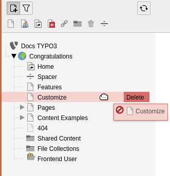
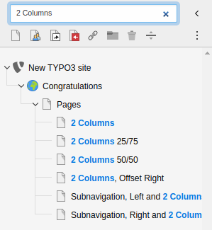

.. include:: /Includes.rst.txt

.. _pages-working-with:
.. _pages-drag-drop:

====================
Работа со страницами
====================

..  youtube:: 1NKE7Pev-D8

------------

Управлять страницами можно непосредственно в дереве страниц.

.. _Move-Pages:

Move pages
==========

#. Выберите перемещаемую страницу и перетащите ее в любое место в дереве страниц.

   На экране появляется горизонтальная линия, указывающая на новое положение страницы.

   .. figure:: ../../Images/ManualScreenshots/PageTree/CopyMovePage.png
      :alt: Перетащите страницу в нужное положение в дереве страниц
      :class: with-border

      Перетащите страницу в нужное положение в дереве страниц

   Синий фон на существующих страницах означает, что страница станет дочерней по отношению к этой странице.

   .. figure:: ../../Images/ManualScreenshots/PageTree/CopyMoveChildPage.png
      :alt: Поместите страницу на другую страницу, чтобы сделать ее дочерней
      :class: with-border

      Поместите страницу на другую страницу, чтобы сделать ее дочерней

#. Отпустите мышь. Появится подтверждающее сообщение с предложением скопировать или переместить страницу.
#. Выберете :guilabel:`Переместить этот элемент` / :guilabel:`Move this item`.

.. _Copy-Pages:

Копирование страниц
===================

#. Выберите страницу, которую необходимо скопировать, и перетащите ее на новое место в дереве страниц.
#. Отпустите мышь, затем выберите :guilabel:`Копировать` / :guilabel:`Copy` в подтверждающем сообщении.

.. _Delete-Pages:

Удаление страниц
================

Выберите страницу, которую необходимо удалить. Перетащите ее вправо, после чего появится опция :guilabel:`Удалить` / :guilabel:`Delete`.

   Перетащите страницу вправо для удаления

Контекстное меню
================

Из контекстного меню, вызываемого правой кнопкой мыши, доступны различные функции.

.. _pages-other-features:
.. _Filter-the-page-tree:

Фильтрация дерева страниц
=========================

В верхней части дерева страниц находится инструмент фильтрации. Щелкните значок фильтра, затем введите слово или цифры, чтобы отфильтровать дерево страниц на основе совпадающих названий или идентификаторов страниц.

   Фильтрация страниц в дереве страниц
