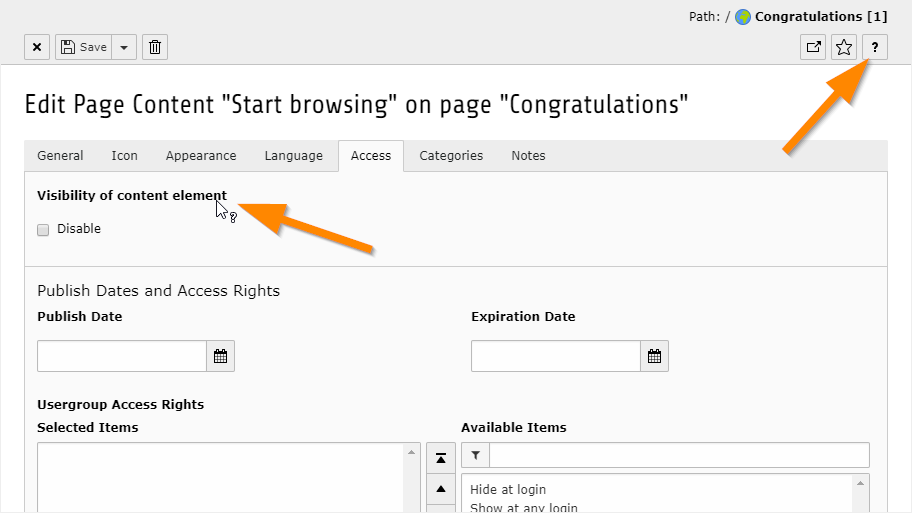

.. include:: /Includes.rst.txt

.. _login:

=====
Login
=====

In TYPO3 CMS an editor's work is done in the backend. So point your browser
to your domain name and append "/typo3" to get to the log in screen.

.. important::

   Make sure JavaScript and cookies are enabled in your browser or nothing will work.

Enter your domain name into the address bar of your internet browser and append "/typo3" to it to get to the "log in" page of your site.
For example: http://www.example.com/typo3.

.. figure:: ../Images/BackendLoginPage.png
   :alt: The TYPO3 CMS backend login screen

Log in and we're ready to go!

.. _help-inside:

Help within TYPO3 CMS
=====================

Before we dive further into using TYPO3 CMS it is useful to remember
that quite some help is available straight inside the backend:

- A very short description of buttons or functions appears if you hover
  with your mouse pointer over it (tooltip).

.. figure:: ../Images/Tooltip.png
   :alt: Tooltip

   See the Tooltip help for the Forms module

- When editing a record, hover over the label of a field. If your cursor changes into
  a question mark, you can click on the label to get a help pop-up.

- You will often see a **question mark icon** next to an element. Clicking on
  it will pop up a little help window about the item or function it is next to:

- For a more extensive description use the **TYPO3 Manual** module in the
  help section. Click on the question mark in the top bar.

.. figure:: ../Images/Typo3Manual.png
   :alt: Various help features in the TYPO3 CMS backend

   Accessing the **TYPO3 Manual**
