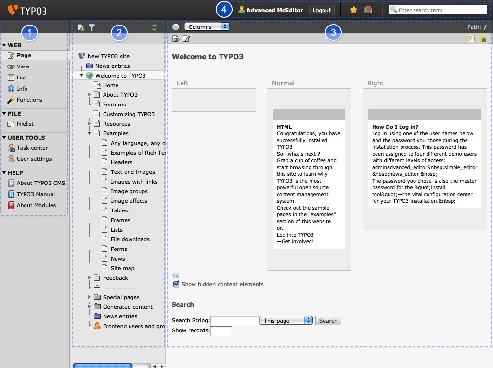

.. ==================================================
.. FOR YOUR INFORMATION
.. --------------------------------------------------
.. -*- coding: utf-8 -*- with BOM.

.. include:: ../Includes.txt

.. _overview:

Overview
--------

You are now in what is called the  **backend** of your site. Usually
all changes to the content of the site are done here. Although there
are ways to perform frontend editing, this tutorial only covers
backend editing.

The backend is divided into  **three columns**. By
selecting "Page" in the first column, you will see a screen similar to
this one:

The first column [1] is the  **menu** , which is used to select the
task you want to perform. The second [2] column contains the **page
tree** , which represents the hierarchy of the pages of the website.
The third column [3] is the **work area**. The fourth area [4] is called
**headerbar**. There you find for example the name of the user that is
logged in (you!) and the logout button. Use the logout button to close
TYPO3. TYPO3 will remember your last work area and come back to it on
the next log on.

What the visitors of the site see is referred to as the **frontend**
= your website.

.. toctree::
   :maxdepth: 5
   :titlesonly:
   :glob:

   Menu/Index
   PageTree/Index
   WorkArea/Index

