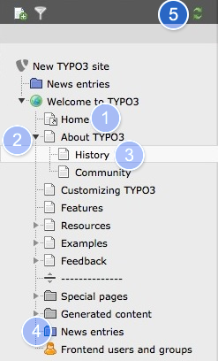
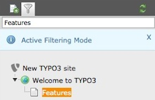
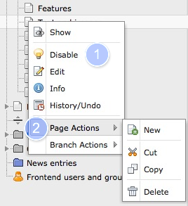

.. ==================================================
.. FOR YOUR INFORMATION
.. --------------------------------------------------
.. -*- coding: utf-8 -*- with BOM.

.. include:: ../../Includes.txt

.. _page-tree:

Page Tree
^^^^^^^^^

In the page tree you will see different icons:

#. Page "Home" is a **shortcut** , that means, if you visit this page in
   the frontend you will be redirected to a different page.

#. Clicking on the arrow expands or implodes the directory tree.

#. Page "History" is a **standard** page

#. "News Entries" is not so much a page but rather a **folder**, they are used to
   store all kinds of items, for example news, newsletters, guest book
   entries, etc.

#. If you created a page and it doesn't appear reload the page tree.

Use the filter (click on icon) to delimit the pages shown in the page tree.

Note that it makes a difference if you click on the icon or on the
name of the page. Clicking on the icon will produce the context menu with page
specific options, while clicking on the name of the page will load the
page in the work area.
