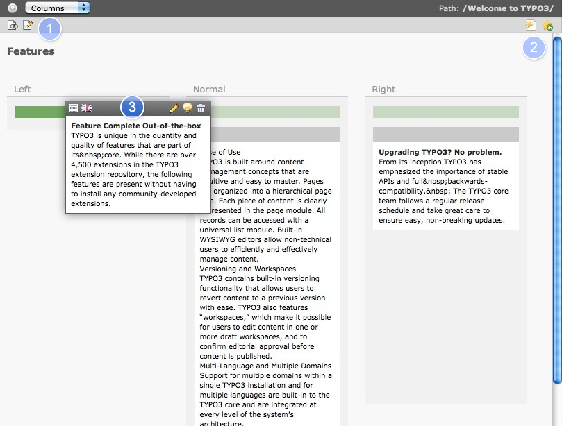

.. ==================================================
.. FOR YOUR INFORMATION
.. --------------------------------------------------
.. -*- coding: utf-8 -*- with BOM.

.. include:: ../../Includes.txt

.. _work-area:

Work Area
^^^^^^^^^

The work area displays the selected module with the content of the page which
you have currently selected in the page tree. It is the part of the backend,
in which you will do most of your work. Inside the work area you create and
edit content and pages. The following sections contain all the details about
the work area you need to know.

The standard view is **Columns** and shows any possible column of a page, **Quickedit**
is more suitable for advanced writers and **Languages** gives access to all available
language versions of this page.

#. The left icon (page with eye) opens a preview in a new window, the right icon
   (pencil) opens the page properties

#. In the right upper corner you will always see your current work directory. The icons
   to clear the page cache (flash) and to create bookmark to this page.

#. To move the content elements up and down in one column or between each other drag
   and drop them with the cursor (click + hold). The green bar in the left column is
   highlighted to offer a possible next position.
