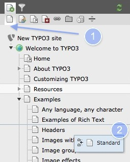
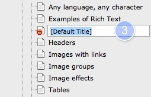
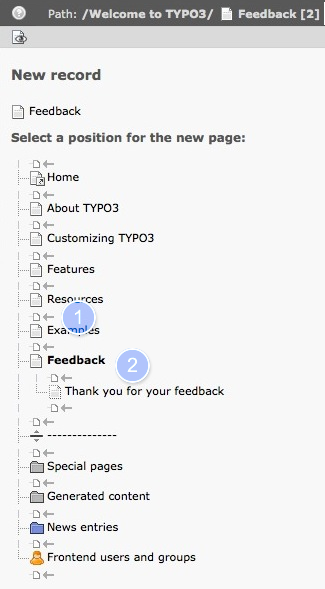
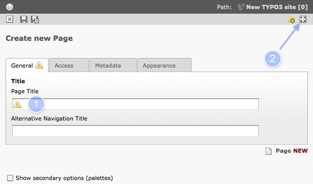

.. ==================================================
.. FOR YOUR INFORMATION
.. --------------------------------------------------
.. -*- coding: utf-8 -*- with BOM.

.. include:: ../../Includes.txt

.. _pages-creating:

Creating Pages
^^^^^^^^^^^^^^

Adding a new page can be done in two ways.

First make sure that you currently are in a module inside the category
Web (e.g. in the page module).

.. _pages-creating-tree:

Adding pages within the page tree
"""""""""""""""""""""""""""""""""

#. pick a page type (here standard)
#. create new page
#. insert page title

A new page is disabled by default. To enable a page, use the context menu or
the page properties.

Clicking on any subitem of  **Create a new page** will immediately
bring up the  **New page** information. Depending upon your selection
you will create a page inside the current one (a subpage), after the
current one (a sibling) or you get a wizard in which you can select
the position of the page.

.. _pages-creating-context:

Adding pages with the context menu
""""""""""""""""""""""""""""""""""

.. figure:: ../../Images/pagetree_img3.png
   :alt: Figure

To activate the context menu click on the icon of a page, not the title. The context menu
concentrates fast access to different actions at one place.

#. for examle disable or enable a page with one mouse click
#. page actions are redundant to drag and drop actions of the page tree

Once the page has been copied or cut, it is copied to your clipboard in TYPO3. Creating a **new page**
with the context menu will lead you to the follwing step:

#. put the page on the same level of the page tree hierarchy **or**
#. put the page inside the page you clicked on, so that it will appear as a child of that page in the page tree.

After selecting the location of the new page you would define the title of the page:

.. _pages-properties:

Page Properties
"""""""""""""""

#. Insert the page title (mandatory) and save
#. opens a new popup window (reasonable on small displays)
