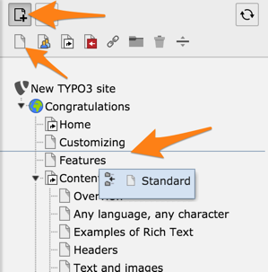

.. include:: /Includes.rst.txt

.. _pages-creating:

==============
Create pages
==============

There are two main ways to add a new page to your site.

First make sure that you are in a **Web** module so that you see the page tree.

.. _pages-creating-tree:

Adding pages within the page tree
=================================

You can create a new page by dragging and dropping a page type from the top of
the page tree.

#. Choose a page type by selecting one of the icons (here a standard page,
   see :ref:`Page types <pages-types>`).

#. Drop the icon either between two existing pages (to create a sibling)
   or on an existing page (to create a child).

#. Type a title for the new page.

   .. figure:: ../../Images/ManualScreenshots/PageCreateTitle.png
      :alt: Inserting a page title
      :class: with-border

New pages are disabled by default. Use the right-click context menu or the
page properties to enable a page.

.. _pages-creating-context:

Adding pages with the context menu
==================================

#. Right-click any existing page and choose :guilabel:`More options > 'Create
   New' Wizard` from the context menu.

   .. figure:: ../../Images/ManualScreenshots/PageCreateContextMenu.png
      :alt: Creating pages with context menu
      :class: with-border

   The **New record** screen displays.

#. Click an arrow in the tree to select the position where you want the new
   page to be created.

   .. figure:: ../../Images/ManualScreenshots/PageCreateWizard.png
      :alt: Selecting a position for the new page using the wizard
      :class: with-border

   The **Create new Page** screen displays.

#. Type a title for the page and you may also like to go to the **Access** tab
   and enable the page to make it visible on the frontend.

   .. figure:: ../../Images/ManualScreenshots/PageCreateEnable.png
      :alt: Making the new page publicly visible
      :class: with-border

More page properties are explained in the :ref:`Page properties <pages-properties>` section.
