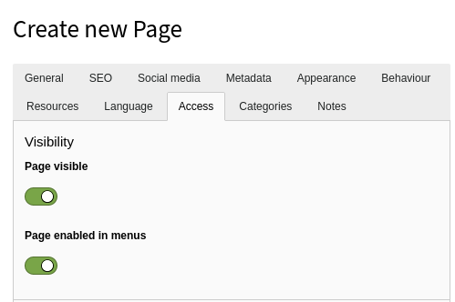

.. include:: /Includes.rst.txt

.. _pages-creating:

==============
Create Pages
==============

There are two main ways to add a new page to your site.

First make sure that you currently are in a **WEB** module
so that you see the page tree.

.. _pages-creating-tree:

Adding pages within the page tree
=================================

As we saw before, you can create a new page by dragging and
dropping a page type from the top of the page tree.

.. figure:: ../../Images/PageCreateDragDrop.png
   :alt: Creating a page using drag and drop

#. Choose a page type by selecting one of the icons (here a standard page,
   see the :ref:`Page types chapter <pages-types>`).

#. Drop the icon either between two existing pages (will create a sibling)
   or on an existing page (will create a child).

#. Insert a title for the new page

.. figure:: ../../Images/PageCreateTitle.png
   :alt: Inserting a page title

A new page is disabled by default. To enable a page, use the context menu or
the page properties.

.. _pages-creating-context:

Adding pages with the context menu
==================================

Click on the icon of any existing page and choose
"Page Actions > New" from the context menu.

.. figure:: ../../Images/PageCreateContextMenu.png
   :alt: Creating pages with context menu

You will be taken to the new page wizard, which asks you
to select a position for the new page.

After selecting a position, you will be taken to the form which
lets you define the properties of the new page. For now, let's
just set the title which is mandatory.

.. figure:: ../../Images/PageCreateProperties.png
   :alt: Editing the page properties

You may also want to move to the *Access* tab and
uncheck the "Disable" box, so that your new page is visible
in your web site.

More properties are explored in the :ref:`Page properties chapter <pages-properties>`.
