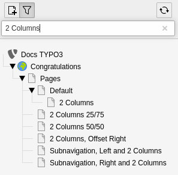

.. include:: /Includes.rst.txt

.. _pages-other-features:

==============
Other features
==============

Let us conclude this overview of working with pages
by mentioning a useful feature. At the top of the page tree
is a filtering tool. It can be used to search in the
page tree, using either words (which will be matched to
the page title) and numbers (which can also be matched to
the id of a given page).

:alt: Filtering pages in the page tree
