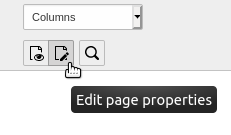

.. include:: /Includes.rst.txt

.. _pages-properties:

===============
Page Properties
===============

To access the page properties, click on the :guilabel:`Edit page properties`
icon in the Docheader.

  The :guilabel:`Edit page properties` icon

The page properties that are available depend on the page typeo and your
TYPO3 installation. The default properties available in the Introduction
Package include:

* General
* SEO
* Social media
* Metadata
* Appearance
* Behaviour
* Resources
* Language
* Access
* Categories
* Notes

.. _pages-properties-titles:

General
=======

The :guilabel:`General` tab includes fields for page titles, URL
and navigation elements.

The :guilabel:`Page Title` is used directly to generate speaking URLs. It is
also used in menus and in the `<title>` tag.

.. figure:: ../../Images/PagePropertiesTitle.png
   :alt: Impact of page title on URL, navigation and metadata
   :class: with-border

    The impact of the :guilabel:`Page Title` on the URL, navigation and
    metadata

You can also specify an alternative navigation title to display a different
title in the menu navigation.

.. figure:: ../../Images/PagePropertiesEditNavigationTitle.png
   :alt: Setting a different title for navigation elements
   :class: with-border

    Setting a different title for navigation elements

When you specify an :guilabel:`Alternative Navigation Title` all other
instances of :guilabel:`Page Title` usage are left unchanged.

.. figure:: ../../Images/PagePropertiesNavigationTitle.png
   :alt: Impact of setting a different navigation title
   :class: with-border

    The impact of setting an alternative navigation title

.. _pages-properties-seo:

SEO
===

.. _pages-properties-social-media:

Social media
============

.. _pages-properties-metadata:

Metadata
========

The fields that are available on the :guilabel:`Metadata` tab depends on how
your site is configured. How the data is used by the frontend is driven by
TypoScript, and again, depends on your site configuration.

Typically, you might see the :guilabel:`Abstract` field, and editorial
details like :guilabel:`Author Name` and :guilabel:`Last Update`.

.. _pages-properties-appearance:

Appearance
==========

The :guilabel:`Appearance` tab contains properties that influence how the
page is rendered in the frontend.

.. figure:: ../../Images/PagePropertiesAppearance.png
   :alt: The "Appearance" tab of the page properties
   :class: with-border

   The :guilabel:`Appearance` tab of the page properties

Backend layouts determine what content areas are made available for editors
in the :guilabel:`Web > Page` module. They can also be used to influence the
rendering of the frontend.

The :guilabel:`Show Content from Page` field tells the page to display the
content from another selected page. This is an easier method for repeating
the content of a single page than using :ref:`mount points <pages-types>`.

.. _pages-properties-behaviour:

Behaviour
=========

The :guilabel:`Behaviour` tab influences a variety of different aspects of
the page.

.. figure:: ../../Images/PagePropertiesBehaviour.png
   :alt: The Behaviour tab of the page properties
   :class: with-border

   The :guilabel:`Behaviour` tab of the page properties

Here is an explanation of some of the common sections and fields:

Links to this Page
------------------

In this section you can set the default Link Target for menu items
linking to the page. You can also specify for the page to open in a new
window.

Caching
-------

This section lets you define a specific cache duration and assign cache
tags to the page. Some TYPO3 extensions can flush pages from the
cache based on their cache tag.

Miscellaneous
-------------

Use as Root Page
  Indicates that this page is the start of a new web site. The page icon
  in the page tree is replaced by a world icon (as displayed for the
  "Congratulations" page of the Introduction Package).

Include in Search
  By default, every page is included in the TYPO3 CMS built-in
  search engine (extension "indexed_search"). Use this flag to
  exclude the current page.

Hide child pages in page tree
  Use this option to exclude the child page of the current page from
  rendering in page tree of the backend. This can be useful if you have a
  lot of subpages.

Use as Container
----------------

The :guilabel:`Contains Plugin` field lets you define the page as containing
a frontend plugin.

.. _pages-properties-resources:

Resources
=========

The :guilabel:`Resources` tab lets you link media files to the current page.
How those files are handled depends on your frontend rendering
configuration.

.. figure:: ../../Images/PagePropertiesResources.png
   :alt: The Resources tab of the page properties
   :class: with-border

   The :guilabel:`Resources` tab of the page properties

The rest of the properties on this tab are related to :ref:`Page TSconfig
<t3tsconfig:pagetsconfig>`.

.. _pages-properties-language:

Language
========

.. _pages-properties-accesss:

Access
======

.. _pages-properties-categories:

Categories
==========

TYPO3 CMS provides a system-wide categorisation tool. By default
categories can be applied to pages, content elements, and files.

.. figure:: ../../Images/PagePropertiesCategories.png
   :alt: The Categories tab of the page properties
   :class: with-border

   The :guilabel:`Categories` tab of the page properties

Categories should be defined in some folder and can then be assigned to
pages. The :ref:`content element type <content-special>` "Special Menus",
for example, can display a list of pages from a selected category.

.. _pages-properties-notes:

Notes
==========
