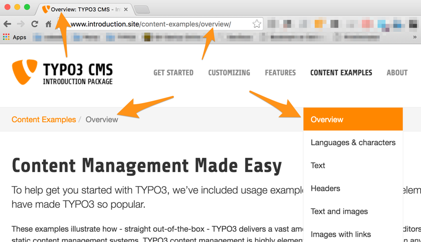
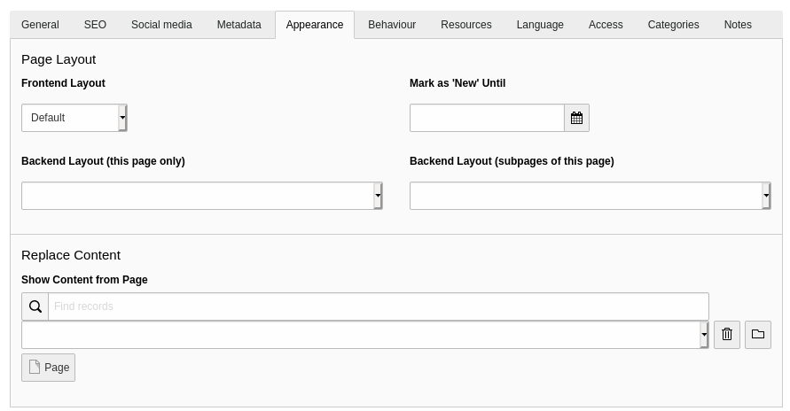
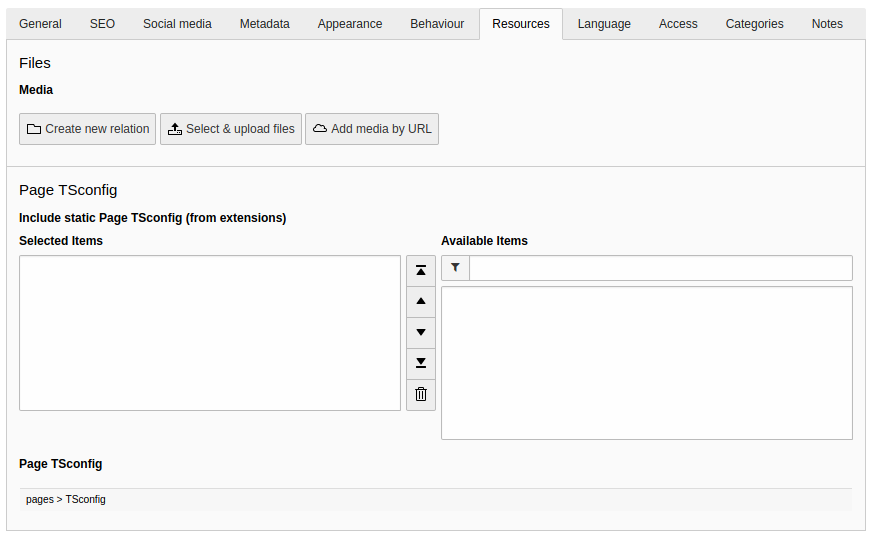
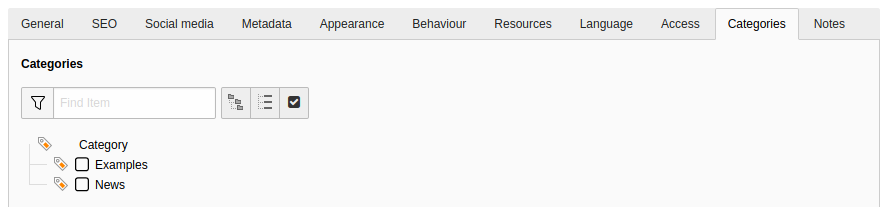

.. include:: ../../Includes.txt

.. _pages-properties:

===============
Page Properties
===============

Pages in TYPO3 CMS have many properties. So far we have seen the
title (which is quite obvious), the "Visibility > Page > Disable"
flag which hides the page in the frontend and the "Visibility >
In menus > Hide" flag which makes it so that the page does not
appear in any navigation element.

.. _pages-properties-titles:

Titles, navigation and URLs
===========================

First off it is interesting to note how page titles, URLs
and navigation elements are related.

The page title is used directly to generate speaking URLs. It is
also used in menus and in the `<title>` tag.

In the page properties, a navigation title can also be defined.

.. figure:: ../../Images/PagePropertiesEditNavigationTitle.png
   :alt: Setting a different title for navigation elements

Let's see the impact this had on the web site:

.. figure:: ../../Images/PagePropertiesNavigationTitle.png
   :alt: Impact of setting a different navigation title

The menu is now using the navigation title. All other instances
of page title usage are left unchanged.

.. note::

   One could argue that the breadcrumb trail is also a navigation element
   and thus should be impacted by this change too. This is true, but
   every menu can be configured separately in TYPO3 CMS and thus have
   a different behaviour.

We will skip the *Access* tab, as access and visibility-related properties
are discussed elsewhere and move on to the other tabs.

.. _pages-properties-metadata:

Metadata
========

A lot of metadata can be entered in the *Metadata* tab. It is all
very standard but it is worth mentioning that the actual usage of
that metadata in the frontend depends on how the site is configured.

The Introduction Package makes use of the "description", "keywords" and
"author" fields to fill the corresponding meta tags. The description
is used again to defined the `og:description` meta tag, whereas the page
title is used for the `og:title` meta tag.

All of this is driven by TypoScript making TYPO3 CMS both powerful
and flexible.

.. _pages-properties-appearance:

Appearance
==========

As can be expected the *Appearance* tab contains properties that will
influence how the page is rendered in the frontend.

Backend layouts determine how many content areas are made available
for input in the **WEB > Page** module. But they can also be used as
information during the rendering to influence the actual output in the
frontend.

An interesting field is "Show content from page" at the bottom of the
screen. It tells the page to display the content from another selected
page. For repeating the content of a single page, this is far easier
to use than :ref:`mount points <pages-types>`.

.. _pages-properties-behaviour:

Behaviour
=========

The *Behaviour* tab has a rich set of options and influences very
different aspects of the page.

.. figure:: ../../Images/PagePropertiesBehaviour.png
   :alt: The "Behaviour" tab of the page properties

The first part is related to linking. It defines if an alias can be
used for linking to this page. This is not related to speaking URLs.
If you define "foo" as an alias, the page can be called up using
:samp:`https://example.org/index.php?id=foo`. A default target for calling
this page can also be defined, as well as a specific protocol.

The caching part lets you define a specific cache duration for this
page or disable the cache entirely for this page (something which you
should avoid). All pages which have the same cache tag will have their
cache deleted when the cache is flushed using that given tag.
Note however that this is not used by TYPO3 CMS by default, but may be
used by extensions.

The language part overrides the default behaviour of translations.
This is covered in more depth in the
:ref:`Frontend Localization Guide <t3l10n:start>`.

Next come a bunch of flags with various meanings:

Use a Root Page
  Indicates that this page is the start of a new web site.
  The page icon is replaced by a world icon, as can be seen
  for the "Congratulations" page.

Include is Search
  By default every page will be included in the TYPO3 CMS built-in
  search engine (extension "indexed_search"). Use this flag to
  exclude the current page.

Hide child pages in page tree:
  Influences only the backend. If enabled, this option excludes the
  subtree from rendering. Very useful if you have a lot of subpages.

Finally the "Use a Container" property is just an indication
of what the page may contain, but does not actually restrict
the types of records that can be created. It will change the page
icon and is just a visual help.

.. _pages-properties-resources:

Resources
=========

The *Resources* tab first and foremost makes it possible to link
media files to the current page. What is done with those links
depends on the frontend rendering configuration. Typically this
may be used to associate an image with each page, but there's no
preconfigured behaviour.

The rest of the properties are related to :ref:`Page TSconfig <t3tsconfig:pagetsconfig>`.
This is a configuration language which can be used to tune many
parts of the backend.

.. _pages-properties-categories:

Categories
==========

TYPO3 CMS provides a system-wide categorisation tool. By default
categories can be applied to pages, content elements, and files.

Categories should be defined in some folder and can then be
assigned to pages. The :ref:`content element type <content-special>`
"Special Menus" can display - among others - a list of pages
from a selected category.
