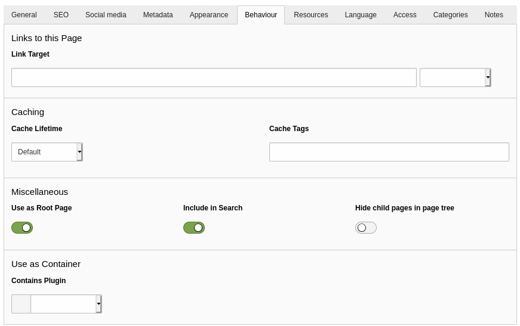

.. include:: /Includes.rst.txt

.. _pages-properties:

===============
Page Properties
===============

To access the page properties, click on the :guilabel:`Edit page properties`
icon in the Docheader.

.. figure:: ../../Images/EditPageProperties.png
  :alt: Edit Page Properties icon
  :class: with-border

The page properties that are available depend on the page type and your
TYPO3 installation. The default properties available in the Introduction
Package for the *Standard* page type include:

* General
* SEO
* Social media
* Metadata
* Appearance
* Behaviour
* Resources
* Language
* Access
* Categories
* Notes

.. _pages-properties-titles:

General
=======

This tab contains general information about the page. You
can change the :guilabel:`Page Type`, and edit titles for the page and the URL.

The :guilabel:`Page Title` is used directly to generate speaking URLs. It is
also used in menus and in the `<title>` tag.

When you specify an :guilabel:`Alternative Navigation Title` all other
instances of :guilabel:`Page Title` usage are left unchanged.

   The **General** tab of the page properties

.. _pages-properties-seo:

SEO
===

This tab is used for search engine optimization. It uses the cs_seo system
extension. See the :ref:'SEO Core extension <cs_seo>' manual for
more information.

.. _pages-properties-social-media:

Social media
============

This tab is used to enrich social media snippets for the URL of the page It
uses the cs_seo system extension. See the :ref:'SEO Core extension <cs_seo:for-editors>' manual for more information.

.. _pages-properties-metadata:

Metadata
========

The fields that are available on this tab depend on how
your site is configured. How the data is used by the frontend is driven by
TypoScript, and again, depends on your site configuration.

Typically, you might see the :guilabel:`Abstract` field, and editorial
details like :guilabel:`Author Name` and :guilabel:`Last Update`.

.. _pages-properties-appearance:

Appearance
==========

This tab contains properties that influence how the page is rendered in the
frontend.

.. figure:: ../../Images/PagePropertiesAppearance.png
   :alt: The "Appearance" tab of the page properties
   :class: with-border

   The **Appearance** tab of the page properties

Backend layouts determine what content areas are made available for editors
in the :guilabel:`Web > Page` module. They can also be used to influence the
rendering of the frontend.

The :guilabel:`Show Content from Page` field tells the page to display the
content from another selected page. This is an easier method for repeating
the content of a single page than using :ref:`mount points <pages-types>`.

.. _pages-properties-behaviour:

Behaviour
=========

This tab influences a variety of different aspects of the page.

   The **Behaviour** tab of the page properties

Here are some of the common fields of the Behaviour tab:

Link Target
   Set the default Link Target for menu items linking to the page. You can
   also specify for the page to open in a new window.

Cache Lifetime
   Define a specific cache duration as well as assign cache tags to the page.
   Some TYPO3 extensions can flush pages from the cache based on their cache
   tag.

Use as Root Page
  Indicates that this page is the start of a new web site. The page icon
  in the page tree is replaced by a world icon (as displayed for the
  "Congratulations" page of the Introduction Package).

Include in Search
  By default, every page is included in the TYPO3 CMS built-in
  search engine :ref:<indexed_search>. Use this flag to
  exclude the current page.

Hide child pages in page tree
  Use this option to exclude the child page of the current page from
  rendering in page tree of the backend. This can be useful if you have a
  lot of subpages.

Contains Plugin
   Lets you define the page as a container for a frontend plugin.

.. _pages-properties-resources:

Resources
=========

This tab lets you link media files to the current page.
How those files are handled depends on your frontend rendering
configuration.

   The **Resources** tab of the page properties

The rest of the properties on this tab are related to :ref:`Page TSconfig
<t3tsconfig:pagetsconfig>`.

.. _pages-properties-language:

Language
========

This tab lets you control the visibility of the page based on localization.

For more information about translation, see :ref:'Working with Languages <languages>.

.. _pages-properties-accesss:

Access
======

This tab lets you control the visibility of the page.

For more information, see :ref:<visibility>.

.. _pages-properties-categories:

Categories
==========

TYPO3 CMS provides a system-wide categorisation tool. By default
categories can be applied to pages, content elements, and files.

.. figure:: ../../Images/PagePropertiesCategories.png
   :alt: The Categories tab of the page properties
   :class: with-border

   The **Categories** tab of the page properties

Categories should be defined in some folder and can then be assigned to
pages. The :ref:`content element type <content-special>` "Special Menus",
for example, can display a list of pages from a selected category.

.. _pages-properties-notes:

Notes
==========

Use this tab for your own editorial notes and internal comments, such as
reminders or to-do lists.

Notes display in the backend above the Page Properties tabs. Notes do not
display on the frontend.
