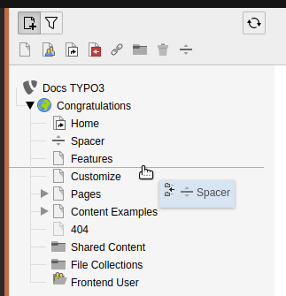
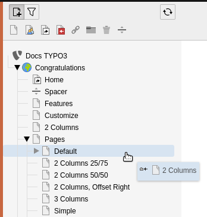

.. include:: /Includes.rst.txt

.. _pages-working-with:
.. _pages-drag-drop:

==================
Working with Pages
==================

You can manage pages directly in the page tree.

.. _Move-Pages:

Move Pages
==========

Choose the page you want to move, then drag it anywhere in the page
tree.

A horizontal line displays to indicate the potential new
position of the page.

   Drag a page to move it on the page tree

A blue background on existing pages indicates that your page will
become a child of that page.

   Drop a page on another page to make it a child page

When you release your mouse, a confirmation message displays offering
the option to copy or move the page. Select :guilabel:`Move this item`.

.. _Copy-Pages:

Copy Pages
==========

Choose the page you want to copy, then drag it to the position on the
page tree you want to copy it. When you release your mouse, select
:guilabel:`Copy` in the confirmation message.

.. _Delete-Pages:

Delete Pages
============

Choose the page you want to delete, then click and drag it directly to
the right. The :guilabel:`Delete` option displays and you can drop your page here.

.. figure:: ../../Images/DeletePage.png
   :alt: Drag a page to the right to delete it
   :class: with-border

   Drag a page to the right to delete it

Context menu
============

A variety of functions are also available from the right-click context
menu, as explained in the :ref:`Getting Started Tutorial <t3start:the-context-menu>`.
