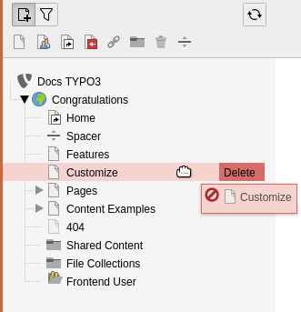

.. include:: /Includes.rst.txt

.. _pages-working-with:
.. _pages-drag-drop:

==================
Working with pages
==================

You can manage pages directly in the page tree.

.. _Move-Pages:

Move pages
==========

#. Choose the page you want to move, then drag it anywhere in the page
   tree.

   A horizontal line displays to indicate the potential new
   position of the page.

   .. figure:: ../../Images/CopyMovePage.png
      :alt: Drag a page to move it on the page tree
      :class: with-border

      Drag a page to move it on the page tree

   A blue background on existing pages indicates that your page will
   become a child of that page.

   .. figure:: ../../Images/CopyMoveChildPage.png
      :alt: Drop a page on another page to make it a child page
      :class: with-border

      Drop a page on another page to make it a child page

#. Release your mouse. A confirmation message displays the option to copy or
   move the page.
#. Select :guilabel:`Move this item`.

.. _Copy-Pages:

Copy pages
==========

#. Choose the page you want to copy, then drag it to the position on the
   page tree you want to copy it.
#. Release your mouse, then select :guilabel:`Copy` in the confirmation
   message.

.. _Delete-Pages:

Delete pages
============

Choose the page you want to delete. Drag it directly to the right to display
the :guilabel:`Delete` option.

   Drag a page to the right to delete it

Context menu
============

A variety of functions are also available from the right-click context
menu, as explained in the :ref:`Getting Started Tutorial <t3start:the-context-menu>`.

.. _pages-other-features:
.. _Filter-the-page-tree:

Filter the page tree
====================

At the top of the page tree is a filtering tool. Click the filter icon, then
type a word or numbers to filter the page tree based on matching page titles
or page ID.

.. figure:: ../../Images/PageTreeFilter.png
   :alt: Filtering pages in the page tree
   :class: with-border

   Filtering pages in the page tree
