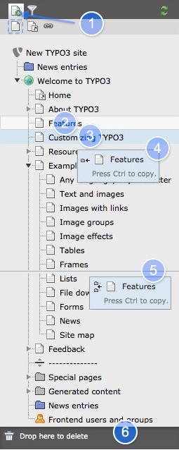

.. ==================================================
.. FOR YOUR INFORMATION
.. --------------------------------------------------
.. -*- coding: utf-8 -*- with BOM.

.. include:: ../../Includes.txt

.. _pages-working-with:

Working with Pages
^^^^^^^^^^^^^^^^^^

You have already seen the page tree, now you will see how easy pages are
created, moved around, hidden and deleted.

.. _pages-drag-drop:

Drag and Drop
"""""""""""""

#. To **expand** the menu with one click and leave it open
#. To **move** an existing page pick it at the page title
#. Drag ist **above** another page, it will be highlighted
#. The box hint is move page **below** another page *or*
#. The box hint is move page **between** two other pages
#. The **trash can** appears as soon as you move any page
