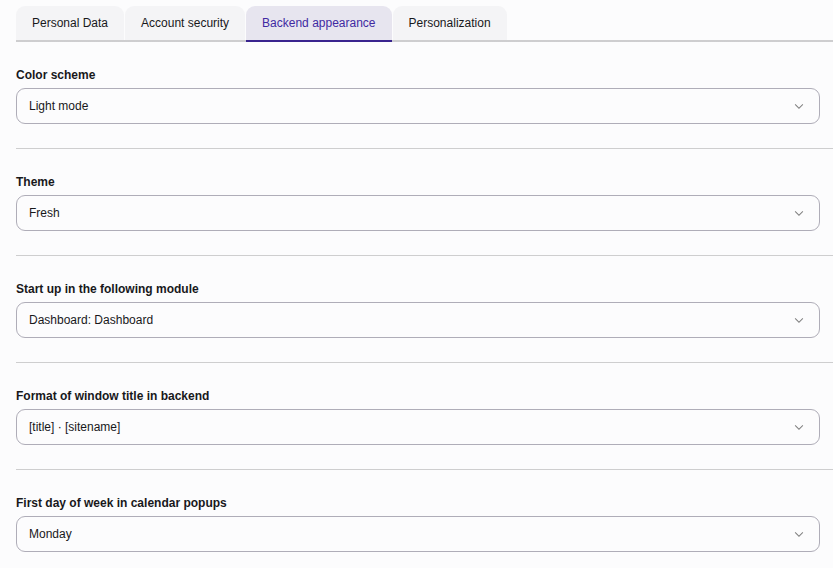
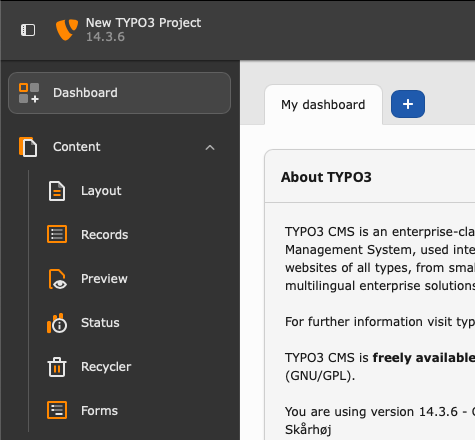
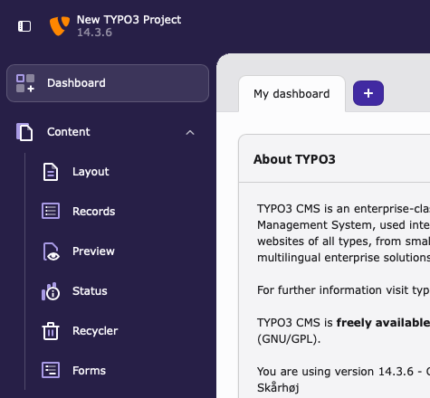
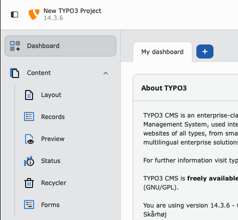

..  include:: /Includes.rst.txt

..  _usersettings-backend-appearance:

==================
Backend appearance
==================

Customise the look, feel, and navigation behavior of your workspace.

*   **Color scheme**: Toggle between light mode and dark mode.
*   **Theme**: Choose an :ref:`installed theme <usersettings-backend-themes>`
    to skin your workspace interface.
*   **Start up in the following module**: Select which module you see
    when you log into the backend (for example,
    :guilabel:`Dashboard`, :guilabel:`Content > Layout`, or :guilabel:`Media`).
*   **Format of window title in backend:** Set the browser tab text (for
    example, choosing whether the page title or your site name is displayed
    first).
*   **First day of week in calendar popups:** Set whether date picker calendar
    popups begin weeks on a Sunday or Monday.

    The backend appearance tab in the user settings module

..  _usersettings-backend-themes:

Backend themes
==============

    The "Classic" backend theme

    The "Fresh" backend theme

    The "Modern" backend theme
