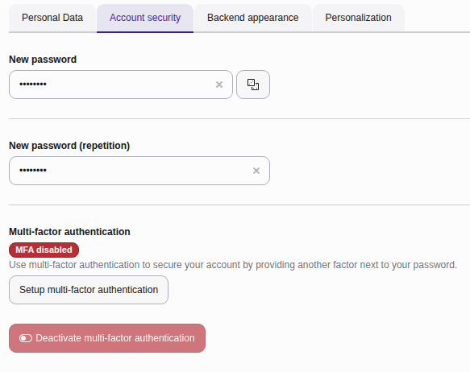
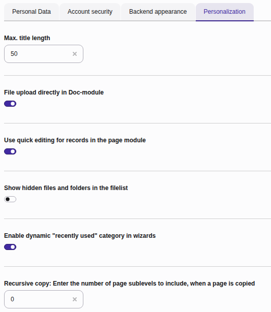

..  include:: /Includes.rst.txt

..  _usersettings:

=============
User settings
=============

The user settings module is where you can check your profile details, change
your password, and customize your backend interface behavior.

First click on your user profile avatar or name in the top-right
corner of the topbar, then select :guilabel:`User Settings`.

..  figure:: ../Images/ManualScreenshots/UserSettings/UserSettingsModule.png
    :alt: The user settings module
    :zoom: lightbox

    The user settings module

You will see four tabs:

..  contents::

..  _usersettings-personal-data:

Personal data
=============

Update your personal identification details and language preferences. You can
update your name and email address but your username cannot be changed here.

*   **Name:** Your full name displayed in the backend interface.
*   **Email:** The address used for system notifications and password resets.
*   **Language:** Changes the language of your backend interface labels and
    menus.

..  tip::
    The relevant language pack needs to be installed and active on your system
    before it can be selected.

..  figure:: ../Images/ManualScreenshots/UserSettings/UserSettingsPersonalData.png
    :alt: The personal data tab in the user settings module
    :zoom: lightbox

    The personal data tab in the user settings module

..  _usersettings-security:

Account security
================

Keep your account secure by managing your authentication credentials.

*   **New password:** Change your password.
*   **Two-Factor Authentication:** Configure or update your multi-factor
    authentication setup for enhanced security.

    The security tab in the user settings module

..  _usersettings-backend-appearance:

Backend appearance
==================

Customise the look, feel, and navigation behavior of your workspace.

*   **Color scheme**: Toggle between light mode and dark mode.
*   **Theme**: Choose an installed theme layout to skin your workspace
    interface.
*   **Start up in the following module**: Set which module you see
    when you log into the backend (for example,
    :guilabel:`Dashboard`, :guilabel:`Content > Layout`, or :guilabel:`Media`).
*   **Format of window title in backend:** Set the browser tab text (for
    example, choosing whether the page title or your site name is displayed
    first).
*   **First day of week in calendar popups:** Set whether date picker calendar
    popups begin weeks on a Sunday or Monday.

..  figure:: ../Images/ManualScreenshots/UserSettings/UserSettingsBackendAppearance.png
    :alt: The backend appearance tab in the user settings module
    :zoom: lightbox

    The backend appearance tab in the user settings module

..  _usersettings-personalization:

Personalization
===============

More settings to fine-tune your workspace behavior.

*   **Max. title length:** Limit the character length of page and record titles
    displayed in lists to keep your workspace clean.
*   **File upload directly in Doc-module:** Enable or disable the direct file
    dropzone and upload button inside your form editing views.
*   **Use quick editing for records in the page module:** Skip the full record
    view and open a streamlined editor when clicking on content elements.
*   **Enable dynamic "recently used" category in wizards:** Allow content
    element wizards to track and display your most frequently used elements
    at the top.
*   **Recursive copy.. :** Toggle whether copying a page should automatically
    copy all of its sub-pages and nested content as well.

    The personalization tab in the user settings module
