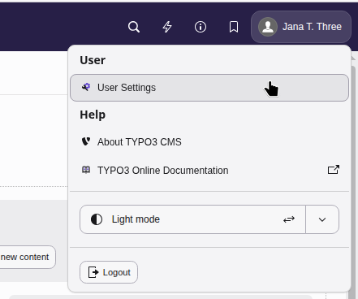

..  include:: /Includes.rst.txt

..  _usersettings:

=============
User settings
=============

The user settings module is where you can check your profile details, change
your password, and customize your backend interface behavior.

First click on your name/user profile avatar in the top-right
corner of the topbar, then select :guilabel:`User Settings`.

    The user settings module
