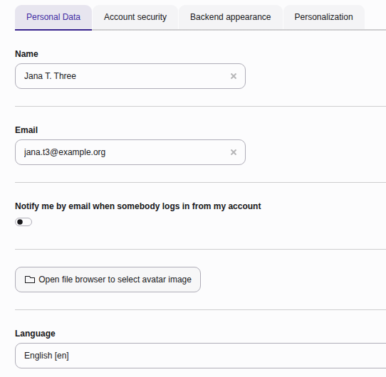
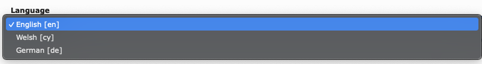

..  include:: /Includes.rst.txt

..  _usersettings-personal-data:

=============
Personal data
=============

Update your personal identification details and language preferences. You can
update your name and email address but your login username cannot be changed
here.

*   **Name:** Your full name displayed in the backend interface.
*   **Email:** The address used for system notifications and password resets.

    The personal data tab in the user settings module

*   **Language:** Changes the language of your
    backend interface labels and menus.

    The language dropdown box on the Personal data tab

..  note::
    A specific language pack needs to be installed and active on your
    system before the language can be selected.
