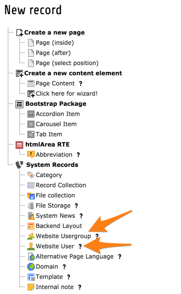
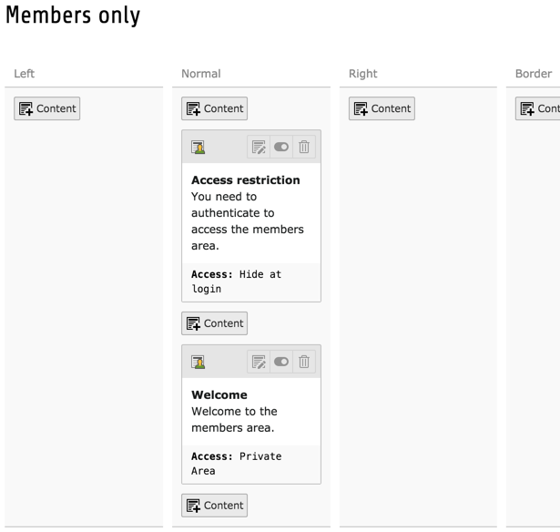
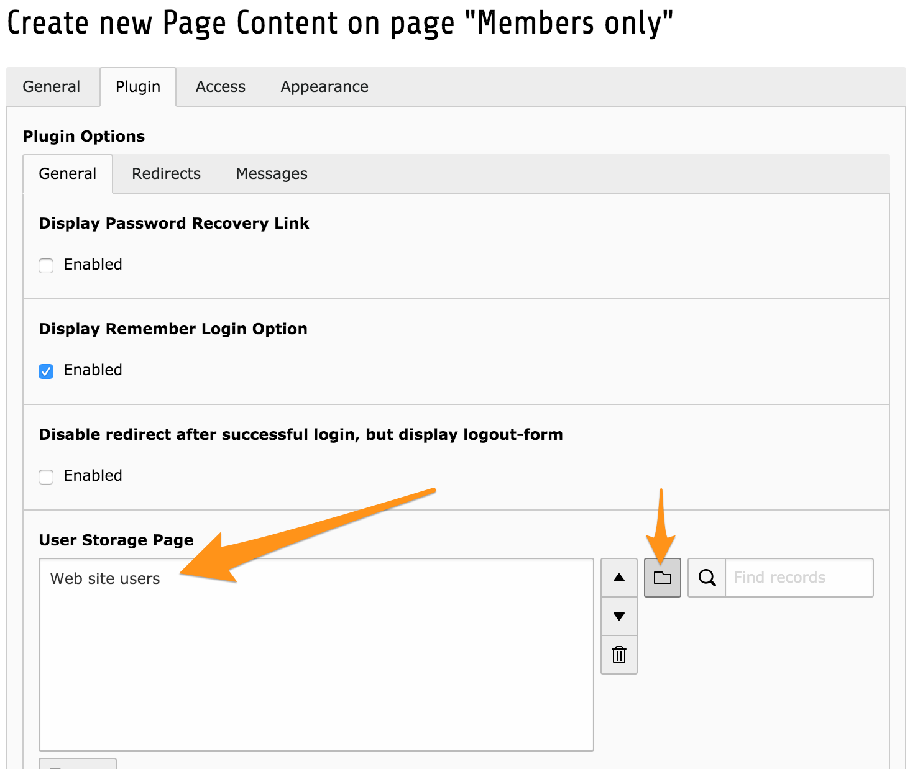

.. include:: ../../Includes.txt

.. _frontend-login:

Connexion frontend
^^^^^^^^^^^^^^^^^^

En allant plus loin, il est effectivement possible
d'exiger une authentification appropriée pour accéder
à des certaines informations présentes sur votre site web.

.. _frontend-login-users:

Les utilisateurs frontend
"""""""""""""""""""""""""

Comme pour le reste de TYPO3 CMS, les utilisateurs sont
séparés en utilisateurs frontend et backend.
Les utilisateurs backend sont utilisés pour s'authentifier
dans le backend et pour gérer votre installation TYPO3 CMS,
créer des pages, saisir du contenu, etc.

Les utilisateurs frontend existent strictement dans le frontend
et sont utilisés pour limiter l'accès aux pages,
à des éléments de contenu et tout autre type d'information
qui repose sur le même mécanisme.

Les utilisateurs frontend font toujours partie de groupes frontend.
L'accès est accordé aux groupes, jamais directement aux utilisateurs.
Les utilisateurs et les groupes sont définis comme tout autre enregistrement
et stockés dans une page appropriée dans le backend.

Utilisez vos nouvelles compétences pour créer une nouvelle
page de type "Dossier" et nommez-le "Utilisateurs du site Web".

.. figure:: ../../Images/AccessUserFolder.png
   :alt: Création d'un dossier pour stocker les utilisateurs et les groupes

Basculer vers la vue **WEB > Liste** et sélectionnez
votre nouveau dossier. Cliquez sur l'icône "Créer un nouvel enregistrement"
à la gauche du menu d'action haut. L'assistant de nouvel enregistrement apparaît.

Cliquez sur "Groupe utilisateur du site web" pour créer
un nouveau groupe d'utilisateurs frontend.

.. figure:: ../../Images/AccessNewGroup.png
   :alt: Création d'un nouveau groupe d'utilisateurs frontend

Donnez lui juste le nom « zone privée », c'est suffisant pour commencer.
Sauvegardez l'enregistrement et fermez-le.
Utilisez à nouveau l'assistant de nouvel enregistrement,
mais cliquez sur "Utilisateur du site".

.. figure:: ../../Images/AccessNewUser.png
   :alt: Création d'un nouvel utilisateurs frontend

Les information minimales requises ici sont un nom d'utilisateur,
un mot de passe et la sélection d'au moins un groupe.
Vous pouvez voir comment notre groupe « zone privée »
nouvellement créé est disponible pour la sélection.

Vous pouvez ajouter des données personnelles à votre utilisateur
si vous le souhaitez, mais cela n'est pas nécessaire.
Vous pouvez sauvegarder l'enregistrement et le fermer.

.. _frontend-login-rights:

Droits d'accès
""""""""""""""

Maintenant que nous avons au moins un groupe,
nous pouvons commencer à attribuer des restrictions d'accès.
Créons une nouvelle page appelée « Membres seulement »
et restreignons la au groupe « zone privée ».

.. figure:: ../../Images/AccessRestrictPage.png
   :alt: Restriction d'accès à la page à un groupe donné

.. note::

   Deux groupes par défaut apparaissent dans la liste des groupes.
   Ce ne sont pas strictement des groupes, dans le sens où
   ils sont toujours disponibles et ne peuvent pas être modifiés ni supprimés.

   Le groupe "Cacher à la connexion" signifie que l'élément
   est visible uniquement lorsque l'utilisateur n'est pas authentifié.
   Le groupe "Afficher à toutes les connexions" est utilisé pour
   les éléments qui nécessitent une authentification d'accès,
   mais à affichier pour tous les groupes.

Remarquez comment l'icône de page change dès que vous enregistrez
les nouveaux droits d'utilisateur. Elle rappelle visuellement
que cette page n'est pas publique.

Essayez d'accéder à cette nouvelle page.
Vous remarquerez que vous êtes redirigé vers la page d'accueil.
La restriction d'accès est en place.

.. _frontend-login-form:

Boîte de connexion
""""""""""""""""""

L'étape suivante consiste à placer une boîte de connexion quelque part
afin que les visiteurs puissent s'authentifier et afficher les informations
à accès limités.

Changeons notre configuration avec les étapes suivantes :

#. Supprimer la restriction d'accès que vous venez de placer
   sur la page "Membres seulement".

#. Créer un élément de contenu "Texte", qui dit quelque chose comme
   « Vous devez vous authentifier pour accéder à la zone des membres »
   et choisissez le groupe "Masquer lors de la connexion"

#. Créer un autre élément de contenu "Texte"
   disant "Bienvenue dans la zone des membres"
   et choisissez le groupe « zone privée » comme droit d'accès.

Vous devriez avoir quelque chose comme ceci :

Ajoutons maintenant une boîte de connexion à la partie.
Cliquez sur le bouton "Créer un nouvel élément de contenu" situé entre
les deux éléments de contenu existants. Dans l'assistant de nouvel élément de contenu,
accédez à l'onglet "Formulaires" et cliquez sur "Formulaire de connexion".

Donnez-lui un titre et de passez à l'onglet "Plugin".

Le formulaire Connexion a beaucoup d'options,
mais la seule qui est absolument nécessaire est
le "Page de stockage des utilisateurs ". Utilisez l'icône
du navigateur d'enregistrement pour afficher l'arborescence de pages
et choisissez le dossier "utilisateurs du site Web".

Enregistrer et afficher la page.
Vous devriez avoir quelque chose comme ceci :

.. figure:: ../../Images/AccessPageWithLoginBox.png
   :alt: La page avec la boîte de connexion

Entrez le nom d'utilisateur et le mot de passe
que vous avez défini précédemment pour le nouvel utilisateur
frontend et vous devriez voir ce qui suit :

.. figure:: ../../Images/AccessPageWithAuthenticatedUser.png
   :alt: La page avec l'utilisateur authentifié

Notez que l'élément de contenu requérant l'authentification a disparu,
remplacé par celui accueillant l'utilisateur.

Ceci est juste un aperçu rapide de la boîte de connexion
fournie par TYPO3 CMS. Elle dispose d'un riche ensemble de fonctionnalités
décrites dans :ref:`son propre manuel <felogin:start>`.
