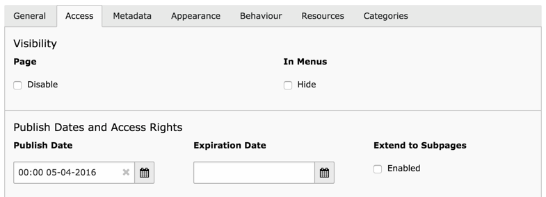

.. include:: ../../Includes.txt

.. _visibility:

Visibilité des élements
^^^^^^^^^^^^^^^^^^^^^^^

L'option qui agit avant tout sur la visibilité d'un élément
est la case à cocher "Désactiver", de la partie "Visibilité"
sur l'onglet "Accès",que nous avons déjà vu auparavant.
Un élément caché, que ce soit une page, un élément de contenu
ou une actualité, ne sera jamais affiché dans le frontend,
à moins que vous n'affichiez un aperçu depuis le backend.

Comme nous l'avons vu dans les :ref:`propriétés de la page <pages-properties>`,
une page peut aussi être exclue de l'affichage dans
les menus et exclue du moteur de recherche intégré à TYPO3 CMS.

Dans le noyau - et dans les extensions qui suivent
les meilleures pratiques - toutes les options liées
à la visibilité sont regroupées dans un onglet nommé "Accès".

.. _visibility-dates:

Les dates de publication
""""""""""""""""""""""""

Un contrôle plus fin peut être exercé avec les dates de
début et de fin de publication . Toute page ou élément de contenu
avec une « Date de publication » définie ne sera pas visible
avant cette date. Si il y a une « Date d'expiration »,
la page ou l'élément de contenu ne sera plus visible sur le site
à partir de cette date.

Fixez une date de publication ultérieure et essayer de naviguer
sur cette page. Vous devriez être redirigé vers la page d'accueil,
ce qui est le comportement par défaut lorsque vous essayez d'accéder
à une page qui est inaccessible (pour une raison quelconque).

Remarquez la case à cocher "Étendre aux sous-pages".
Si elle est cochée, la date de publication (et les autres restrictions d'accès)
sera également appliquée à toutes les pages filles de la page courante.
Cela permet d'appliquer des restrictions à toute une branche de l'arborescence de pages.
